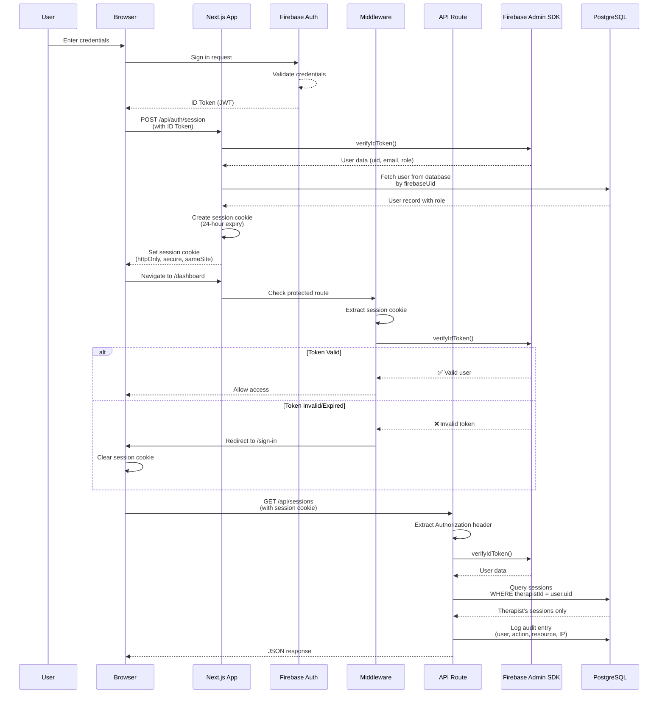
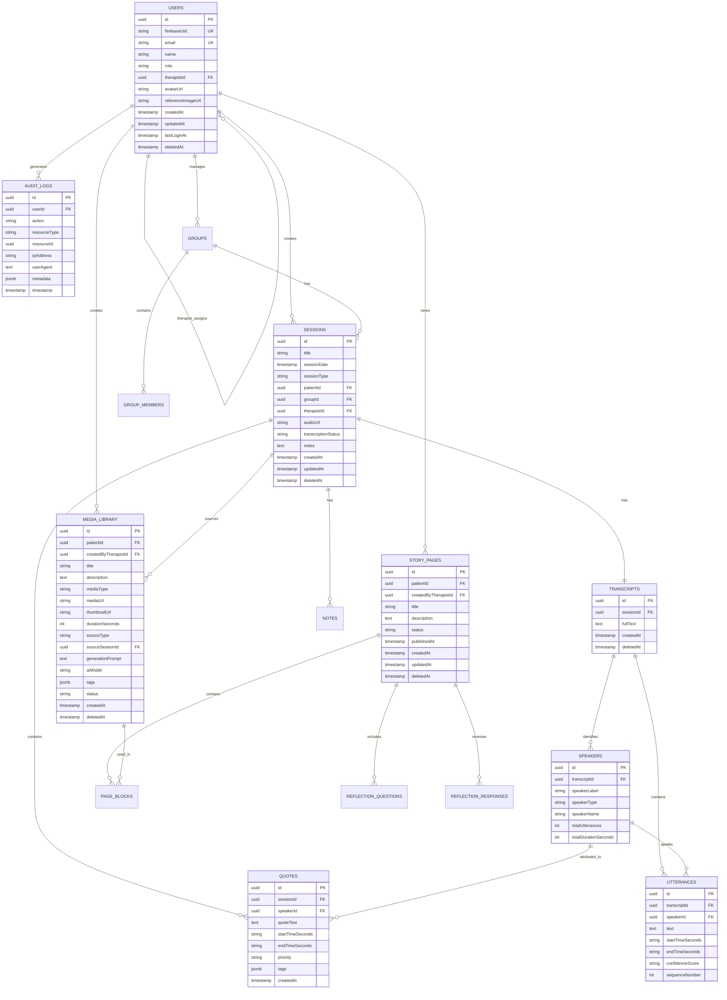
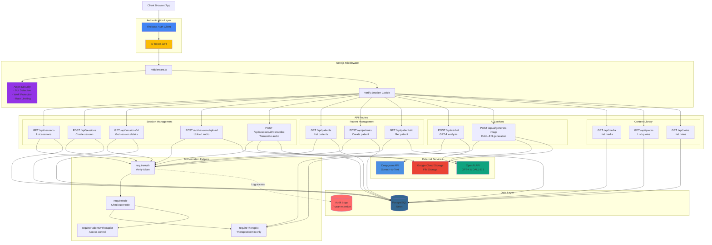
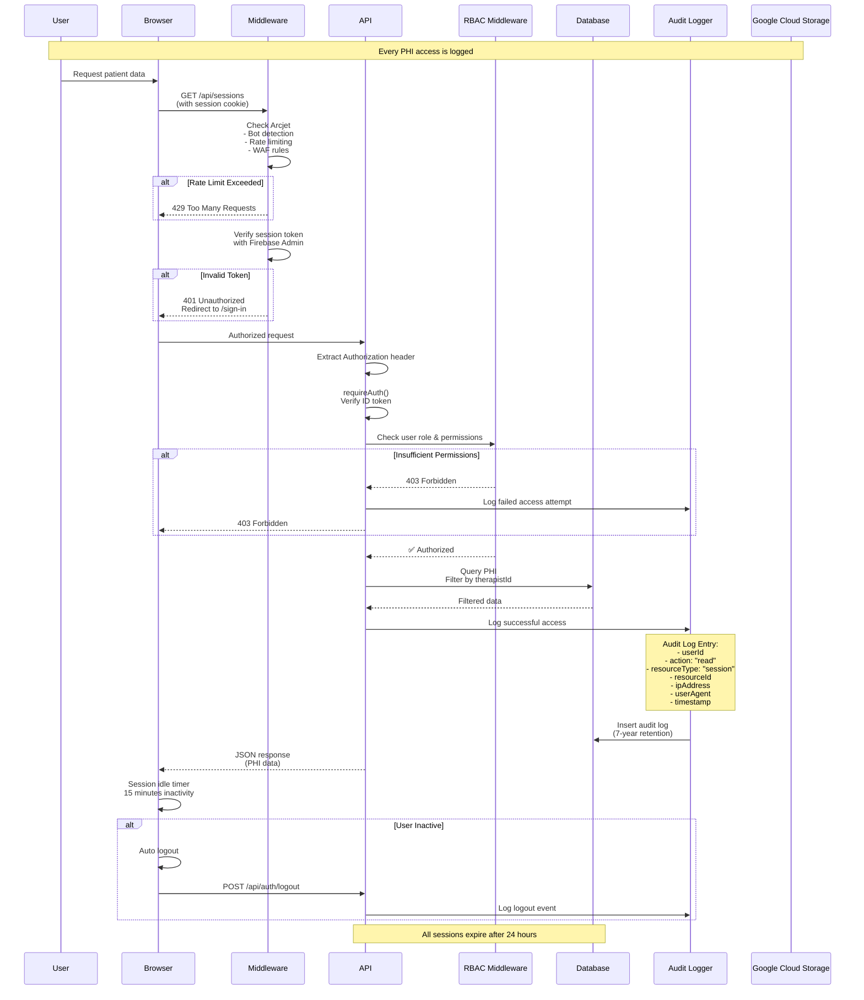
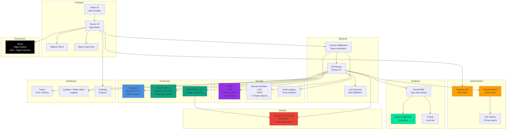

# StoryCare System Architecture - Mermaid Diagrams

This document contains comprehensive Mermaid diagrams for the StoryCare digital therapeutic platform.

## Table of Contents
1. [Complete Session Workflow](#complete-session-workflow)
2. [Authentication Flow](#authentication-flow)
3. [Database Schema Overview](#database-schema-overview)
4. [API Architecture](#api-architecture)

---

## Complete Session Workflow

### Full Journey: Audio Upload to Patient Story Page

```mermaid
flowchart TD
    Start([Therapist Uploads Audio]) --> Upload[Upload Audio File]
    Upload --> GCS1[Google Cloud Storage]
    GCS1 --> DB1[(Create Session Record)]

    DB1 --> Transcribe[POST /api/sessions/id/transcribe]

    Transcribe --> Deepgram[Deepgram API<br/>Model: nova-2]
    Deepgram --> DG_Process{Processing}

    DG_Process --> DG_Result[Transcription Result:<br/>- Full text<br/>- Speakers identified<br/>- Timestamps<br/>- Confidence scores]

    DG_Result --> DB2[(Store Transcript)]
    DB2 --> Speaker_Label[Therapist Labels Speakers<br/>Speaker 1 → Dr. Smith<br/>Speaker 2 → John]

    Speaker_Label --> AI_Analysis[POST /api/ai/chat]
    AI_Analysis --> GPT4[OpenAI GPT-4 Turbo]
    GPT4 --> Analysis[AI Analysis:<br/>- Key themes<br/>- Emotional patterns<br/>- Growth indicators<br/>- Therapeutic insights]

    Analysis --> Extract_Quote[Extract Meaningful Quotes]
    Extract_Quote --> DB3[(Store Quotes)]

    DB3 --> Generate_Image[Generate Image]
    Generate_Image --> Image_Prompt[Generate DALL-E Prompt via GPT-4]
    Image_Prompt --> DALLE[OpenAI DALL-E 3]

    DALLE --> DALLE_Config{Image Configuration}
    DALLE_Config --> Size[Size: 1024x1024<br/>1792x1024<br/>1024x1792]
    DALLE_Config --> Quality[Quality: standard/hd]
    DALLE_Config --> Style[Style: natural/vivid]

    Size & Quality & Style --> DALLE_Result[Generated Image URL]
    DALLE_Result --> GCS2[Download & Store in GCS]
    GCS2 --> DB4[(Store in media_library)]

    DB4 --> Assets[View in /assets page]
    Assets --> Story_Page[Create Story Page]
    Story_Page --> Patient_View[Patient Views Story Page]

    Patient_View --> Reflection[Patient Answers<br/>Reflection Questions]
    Reflection --> DB5[(Store Responses)]
    DB5 --> Dashboard[Analytics Dashboard]

    style Deepgram fill:#4A90E2
    style GPT4 fill:#10A37F
    style DALLE fill:#10A37F
    style GCS1 fill:#EA4335
    style GCS2 fill:#EA4335
    style DB1 fill:#336791
    style DB2 fill:#336791
    style DB3 fill:#336791
    style DB4 fill:#336791
    style DB5 fill:#336791
```



---

## Authentication Flow

### Firebase Authentication & Session Management



---

## Database Schema Overview

### Core Tables and Relationships



---

## API Architecture

### API Route Structure and Authorization



---

## Transcription Process (Detailed)

### Deepgram Speech-to-Text Pipeline

```mermaid
flowchart LR
    subgraph "Input"
        Audio[Audio File<br/>in GCS]
    end

    subgraph "Deepgram API"
        direction TB
        DG_Start[Start Transcription]
        DG_Config[Configuration:<br/>- Model: nova-2<br/>- Language: en<br/>- Diarization: true<br/>- Punctuation: true<br/>- Smart format: true]
        DG_Process[Process Audio:<br/>1. Speech Recognition<br/>2. Speaker Identification<br/>3. Timestamp Generation<br/>4. Confidence Scoring]
        DG_Result[Result Object]
    end

    subgraph "Transcript Structure"
        direction TB
        Full[Full Text Transcript]

        Utterances[Utterances Array]
        U1[Utterance 1:<br/>- speaker: 0<br/>- start: 0.5s<br/>- end: 5.2s<br/>- text: "I've been..."<br/>- confidence: 0.98]
        U2[Utterance 2:<br/>- speaker: 1<br/>- start: 5.5s<br/>- end: 10.1s<br/>- text: "That's great..."<br/>- confidence: 0.95]

        Words[Words Array]
        W1[Word 1: "I"<br/>start: 0.5, end: 0.6<br/>speaker: 0]
        W2[Word 2: "have"<br/>start: 0.6, end: 0.8<br/>speaker: 0]

        Utterances --> U1 & U2
        Words --> W1 & W2
    end

    subgraph "Database Storage"
        direction TB
        T_Table[(transcripts table)]
        S_Table[(speakers table)]
        U_Table[(utterances table)]

        T_Record[Transcript Record:<br/>- sessionId<br/>- fullText]
        S_Record[Speaker Records:<br/>- Speaker 1: 45 utterances<br/>- Speaker 2: 38 utterances]
        U_Record[Utterance Records:<br/>- All timestamped segments<br/>- Speaker attribution<br/>- Confidence scores]

        T_Table --> T_Record
        S_Table --> S_Record
        U_Table --> U_Record
    end

    Audio --> DG_Start
    DG_Start --> DG_Config
    DG_Config --> DG_Process
    DG_Process --> DG_Result

    DG_Result --> Full & Utterances & Words

    Full --> T_Record
    Utterances --> S_Record & U_Record

    style Audio fill:#EA4335
    style DG_Start fill:#4A90E2
    style DG_Config fill:#4A90E2
    style DG_Process fill:#4A90E2
    style DG_Result fill:#4A90E2
    style T_Table fill:#336791
    style S_Table fill:#336791
    style U_Table fill:#336791
```

---

## Image Generation Process (Detailed)

### DALL-E 3 Content Creation Pipeline

```mermaid
flowchart TD
    subgraph "Input Sources"
        Transcript[Session Transcript]
        Theme[Optional Theme<br/>e.g., "hope", "growth"]
        Quote[Selected Quote]
    end

    subgraph "Stage 1: Prompt Generation"
        GPT4_1[GPT-4 Turbo]
        System1[System Prompt:<br/>"Create DALL-E prompts for<br/>therapeutic narratives...<br/>- Metaphorical<br/>- Healing-oriented<br/>- Safe for therapy"]
        User1[User Prompt:<br/>"Theme: hope<br/>Transcript: [excerpt]<br/>Create image prompt"]
        Result1[Generated DALL-E Prompt:<br/>"A person standing at the edge<br/>of a calm lake at sunrise,<br/>with golden light breaking<br/>through clouds, symbolizing<br/>hope and new beginnings.<br/>Watercolor style, peaceful,<br/>healing."]
    end

    subgraph "Stage 2: Image Generation"
        DALLE[DALL-E 3 API]
        Config{Configuration}
        Size[Size Options:<br/>- 1024x1024 square<br/>- 1792x1024 landscape<br/>- 1024x1792 portrait]
        Quality[Quality:<br/>- standard default<br/>- hd detailed]
        Style[Style:<br/>- natural more realistic<br/>- vivid more dramatic]

        Generate[Generate Image]
        TempURL[Temporary Image URL<br/>from OpenAI<br/>Expires in 1 hour]
    end

    subgraph "Stage 3: Storage"
        Download[Download Image]
        GCS[Upload to Google Cloud Storage]
        PermanentURL[Permanent URL]

        DB_Insert[Insert into media_library]
        Record[Media Record:<br/>- title: Quote/theme<br/>- mediaType: 'image'<br/>- mediaUrl: GCS URL<br/>- generationPrompt: prompt<br/>- aiModel: 'dall-e-3'<br/>- patientId<br/>- sourceSessionId<br/>- tags: array]
    end

    Transcript & Theme & Quote --> GPT4_1
    GPT4_1 --> System1 & User1
    System1 & User1 --> Result1

    Result1 --> DALLE
    DALLE --> Config
    Config --> Size & Quality & Style
    Size & Quality & Style --> Generate
    Generate --> TempURL

    TempURL --> Download
    Download --> GCS
    GCS --> PermanentURL
    PermanentURL --> DB_Insert
    DB_Insert --> Record

    style GPT4_1 fill:#10A37F
    style DALLE fill:#10A37F
    style GCS fill:#EA4335
    style DB_Insert fill:#336791
```

---

## Security & Audit Flow

### HIPAA Compliance Architecture



---

## Technology Stack Overview



---

## Models & Technologies Summary

### AI Models Used

| Service | Model | Purpose | Key Features |
|---------|-------|---------|--------------|
| **Deepgram** | `nova-2` | Speech-to-Text | • Automatic speech recognition<br/>• Speaker diarization<br/>• Word-level timestamps<br/>• 98%+ accuracy |
| **OpenAI** | `gpt-4-turbo-preview` | Analysis & Prompts | • Transcript analysis<br/>• Therapeutic insights<br/>• Image prompt generation<br/>• Quote extraction |
| **OpenAI** | `dall-e-3` | Image Generation | • High-quality images<br/>• Natural/vivid styles<br/>• Multiple sizes<br/>• Therapeutic imagery |

### Storage & Infrastructure

| Service | Purpose | Configuration |
|---------|---------|---------------|
| **Neon** | PostgreSQL Database | • Serverless scaling<br/>• SSL/TLS encryption<br/>• Automated backups |
| **Google Cloud Storage** | File Storage | • Private buckets<br/>• Signed URLs (1-hour expiry)<br/>• Server-side encryption |
| **Firebase** | Authentication | • JWT tokens (24-hour)<br/>• Custom claims for roles<br/>• Session management |
| **Vercel** | Hosting | • Edge functions<br/>• CDN distribution<br/>• Automatic deployments |

---

**Last Updated:** 2025-10-30
**Document Version:** 1.0
**Maintained By:** Development Team
