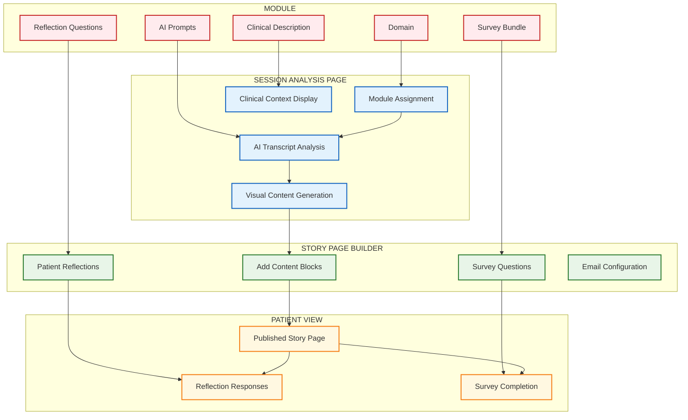

# StoryCare Module Components Usage Flow

## Module Components Distribution

**Summary**: This diagram shows exactly where each module component is used:
- **Domain + Description** → Session Analysis Page (for module assignment and clinical context)
- **AI Prompts** → Session Analysis Page (for transcript analysis)
- **Reflection Questions + Survey Bundle** → Story Page Builder (for patient engagement)