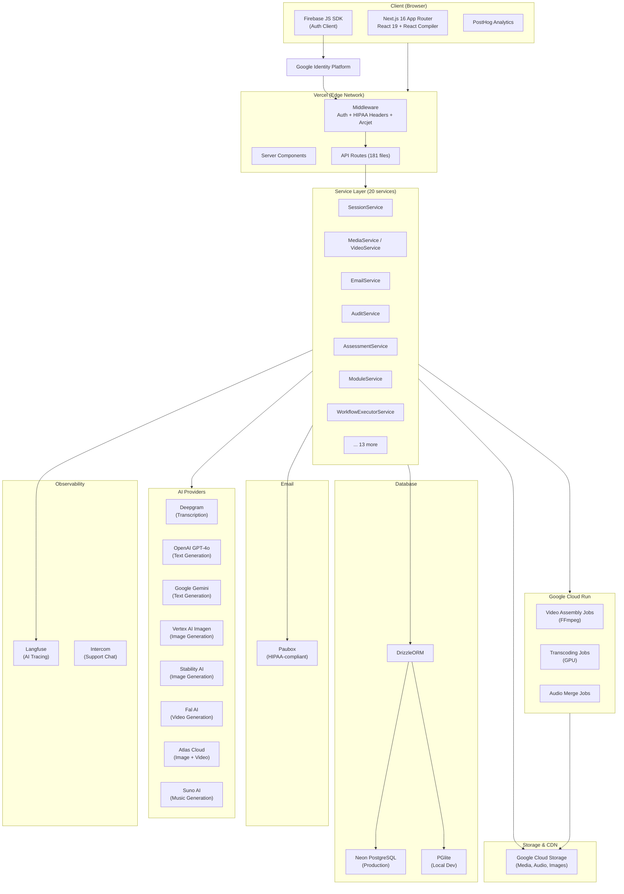
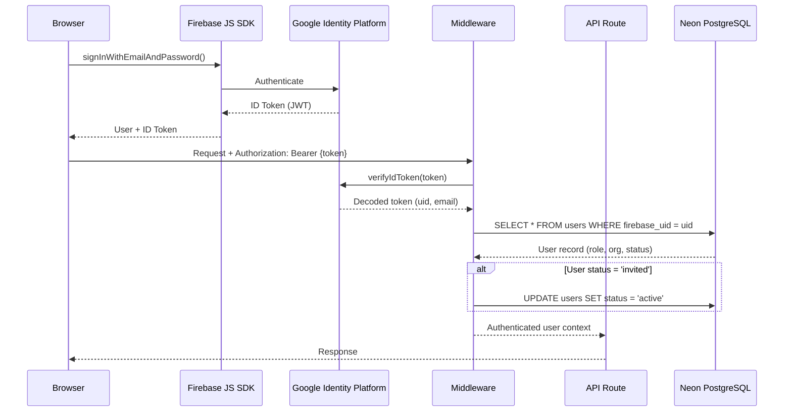
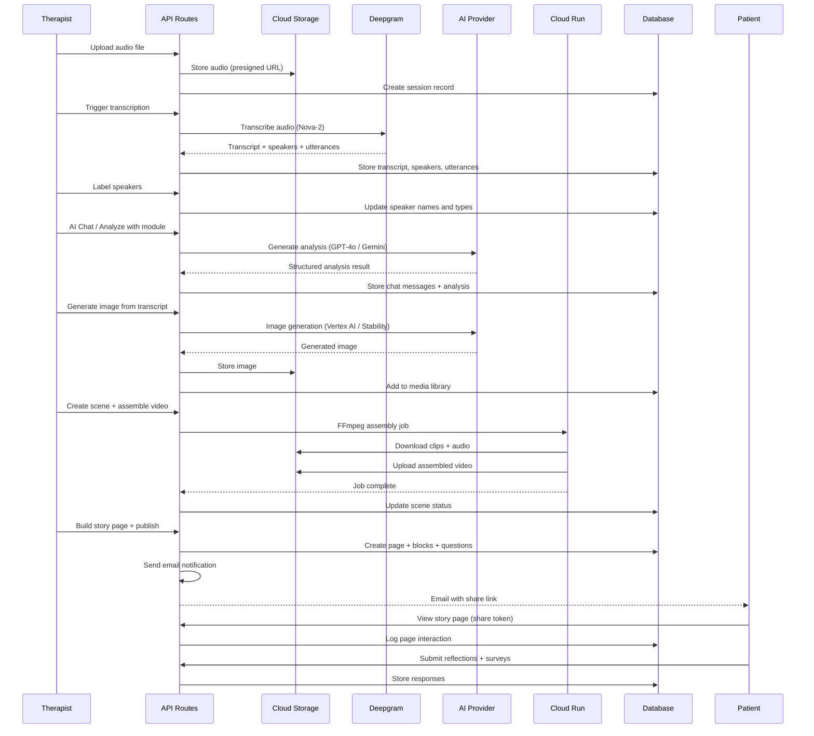
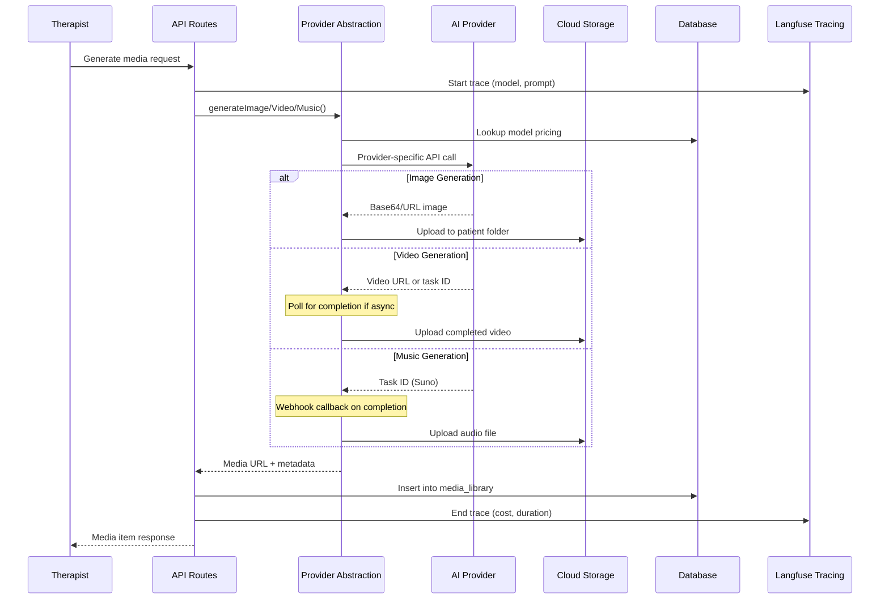
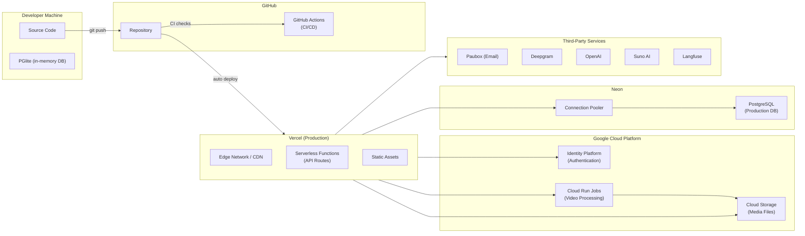

# StoryCare Architecture

> [!NOTE]
> This document describes the system architecture, data flows, deployment topology, and key technology decisions for the StoryCare platform.

---

## System Architecture

---

## Data Flow Diagrams

### Authentication Flow

### Session Workflow (Upload to Story Page)

### Media Generation Flow

---

## Deployment Architecture

### Deployment Configuration

| Environment | Database | DB Driver | Max Connections | Idle Timeout |
|---|---|---|---|---|
| Local Development | PGlite (in-memory) | `@electric-sql/pglite` | N/A | N/A |
| Production | Neon PostgreSQL | `pg` via Drizzle | 10 | 30s |
| Cloud Run Jobs | Neon PostgreSQL | `pg` via Drizzle | 5 | 30s |

---

## Technology Decisions

| Category | Choice | Why |
|---|---|---|
| **Framework** | Next.js 16 (App Router) | Server components, API routes, edge runtime, Vercel-optimized deployment |
| **Language** | TypeScript (strict) | Type safety across full stack, shared types between client and server |
| **Styling** | Tailwind CSS 4 | Utility-first, fast iteration, zero-runtime CSS, excellent DX |
| **UI Library** | React 19 + React Compiler | Automatic memoization, improved performance, concurrent features |
| **ORM** | DrizzleORM | Type-safe SQL, lightweight, excellent PostgreSQL support, migration tooling |
| **Database** | Neon (Serverless PostgreSQL) | Serverless scaling, branching, connection pooling, HIPAA-eligible |
| **Local DB** | PGlite | Zero-config PostgreSQL in-process, identical SQL for dev/prod parity |
| **Auth** | Google Identity Platform | HIPAA-eligible, MFA, social auth, Firebase SDK compatibility |
| **Hosting** | Vercel | Automatic deployments, edge CDN, serverless functions, enterprise support |
| **Storage** | Google Cloud Storage | Presigned URLs, fine-grained IAM, regional buckets, HIPAA-eligible |
| **Video Processing** | Google Cloud Run Jobs | Scale-to-zero, GPU support, containerized FFmpeg, cost-efficient |
| **Email** | Paubox | HIPAA-compliant encrypted email, required for PHI communication |
| **Transcription** | Deepgram (Nova-2) | Best-in-class accuracy, speaker diarization, real-time support |
| **Text AI** | OpenAI + Gemini | Multi-provider resilience, GPT-4o for analysis, Gemini for cost optimization |
| **Image AI** | Vertex AI + Stability AI + Atlas Cloud | Imagen 3 quality, multi-provider fallback, image-to-image support |
| **Video AI** | Fal AI + Atlas Cloud | Fast generation, image-to-video, text-to-video |
| **Music AI** | Suno AI (V4.5/V5) | Custom therapeutic music, instrumental mode, vocal gender control |
| **AI Tracing** | Langfuse | Cost tracking per model, prompt versioning, latency monitoring |
| **Security** | Arcjet | Bot detection, WAF (OWASP Top 10), rate limiting, Shield |
| **Forms** | React Hook Form + Zod | Performant forms, schema-driven validation, TypeScript integration |
| **Testing** | Vitest + Playwright | Fast unit tests, real browser E2E, Storybook integration |
| **Linting** | ESLint (Antfu config) | Opinionated defaults, import sorting, formatting integration |
| **Analytics** | PostHog | Privacy-focused, self-hostable, feature flags, session replay |
| **Support** | Intercom | In-app chat, knowledge base, user onboarding |

---

## Connection & Performance Configuration

| Setting | Development | Production | Cloud Run |
|---|---|---|---|
| Database driver | PGlite (in-memory) | `pg` (TCP) | `pg` (TCP) |
| Max connections | N/A | 10 | 5 |
| Idle timeout | N/A | 30s | 30s |
| Auth token expiry | 24 hours | 24 hours | N/A |
| Session timeout | 15 min (configurable) | 15 min (configurable) | N/A |
| Rate limiting | Disabled | Arcjet | N/A |
| HIPAA headers | Yes | Yes | N/A |
| Audit logging | Yes | Yes | N/A |
| AI tracing | Optional | Langfuse | N/A |

---

## Security Architecture

> [!IMPORTANT]
> StoryCare is a HIPAA-compliant platform. All PHI (Protected Health Information) is stored in Neon PostgreSQL with encryption at rest. Firebase Auth user metadata does NOT contain PHI.

### Security Layers

1. **Edge (Vercel Middleware)**: HIPAA security headers (CSP, HSTS, X-Frame-Options, X-Content-Type-Options), Arcjet WAF Shield
2. **Authentication**: Google Identity Platform with custom database roles, automatic user activation on first login
3. **Authorization**: Role-based access control (RBAC) enforced in API routes via `verifyIdToken()`
4. **Data Protection**: Parameterized queries (DrizzleORM), input validation (Zod), data encryption at rest (Neon)
5. **Audit Trail**: All PHI access logged in `audit_logs` table with IP, user agent, request details
6. **Email**: HIPAA-compliant email via Paubox (NOT SendGrid)
7. **Storage**: Presigned URLs with expiration for GCS media access
8. **Soft Delete**: HIPAA-mandated 90-day retention before permanent deletion

---

## Key Architectural Patterns

### Provider Abstraction

AI providers are abstracted behind unified interfaces in `src/libs/`:

- `TextGeneration.ts` - OpenAI, Gemini providers
- `ImageGeneration.ts` - Vertex AI, Stability AI, Gemini, Atlas Cloud providers
- `VideoGeneration.ts` - Fal AI, Atlas Cloud providers
- `SunoAI.ts` - Suno AI music generation

Providers are implemented in `src/libs/providers/` and can be swapped via environment configuration without changing application code.

### Service Layer

Business logic is encapsulated in `src/services/`, keeping API routes thin. Services handle database queries, external API calls, and complex orchestration (e.g., `WorkflowExecutorService` for building blocks workflows).

### Building Blocks Workflow

The building blocks system provides a visual workflow editor for therapeutic prompts. Blocks are composable units (AI text generation, image generation, conditional logic) that execute sequentially with accumulated context. Execution state is persisted in `workflow_executions` for resumability.

---

*Last updated: 2026-02-19*
