# Entity Relationship Diagram Overview

> [!NOTE]
> This document provides visual ERD diagrams and relationship tables for all 48 database tables in StoryCare, organized by domain. All schema definitions live in a single file: `src/models/Schema.ts`.

---

## Quick Stats

| Metric | Count |
|---|---|
| Total Tables | 48 |
| Enum Types | 38 |
| JSONB Columns | 25+ |
| Tables with Soft Delete | 5 (users, patient_reference_images, transcripts, sessions, media_library) |
| Tables with Indexes | 8 |
| Unique Constraints | 10+ |
| Foreign Key Relationships | 90+ |

---

## Domain Navigator

| Domain | Tables | Description |
|---|---|---|
| [Users & Organizations](#users--organizations) | organizations, users, patient_reference_images, groups, group_members, therapist_patient_archives | Multi-tenant user management |
| [Sessions & Transcription](#sessions--transcription) | sessions, transcripts, speakers, utterances | Therapy session audio processing |
| [AI Chat](#ai-chat) | ai_chat_messages | Session-scoped AI conversations |
| [Media & Assets](#media--assets) | media_library, music_generation_tasks, quotes, notes | Generated and uploaded media |
| [Templates & Modules](#templates--modules) | treatment_modules, module_ai_prompts, module_prompt_links, user_prompt_order, session_modules, survey_templates, reflection_templates, therapeutic_prompts, workflow_executions | Therapeutic content library |
| [Email](#email) | email_notifications | HIPAA-compliant email delivery |
| [Scenes & Video](#scenes--video) | scenes, scene_clips, scene_audio_tracks, video_processing_jobs, video_transcoding_jobs | Video composition and processing |
| [Story Pages](#story-pages) | story_pages, page_share_links, page_blocks, reflection_questions, survey_questions, reflection_responses, survey_responses, patient_page_interactions | Patient-facing content delivery |
| [Recordings](#recordings) | recording_links, uploaded_recordings | Audio recording capture |
| [AI Models](#ai-models) | ai_models | AI model registry and pricing |
| [Clinical Assessments](#clinical-assessments) | assessment_instruments, assessment_instrument_items, assessment_sessions, assessment_responses | Validated clinical instruments |
| [Platform](#platform) | platform_settings, audit_logs, feature_toggles | Platform configuration and compliance |

---

## Users & Organizations

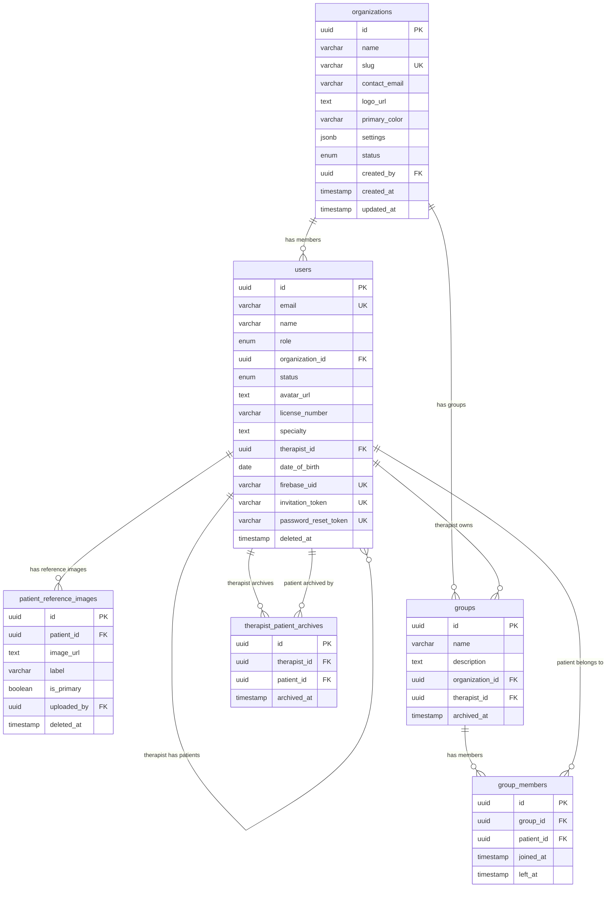

### Relationships

| Parent | Child | Cardinality | FK Column | On Delete |
|---|---|---|---|---|
| organizations | users | 1:N | `organization_id` | RESTRICT |
| users (therapist) | users (patient) | 1:N | `therapist_id` | - |
| users | patient_reference_images | 1:N | `patient_id` | CASCADE |
| users | patient_reference_images | N:1 | `uploaded_by` | - |
| organizations | groups | 1:N | `organization_id` | CASCADE |
| users | groups | 1:N | `therapist_id` | - |
| groups | group_members | 1:N | `group_id` | CASCADE |
| users | group_members | 1:N | `patient_id` | CASCADE |
| users | therapist_patient_archives | 1:N | `therapist_id` | CASCADE |
| users | therapist_patient_archives | 1:N | `patient_id` | CASCADE |

---

## Sessions & Transcription

```mermaid
erDiagram
    sessions {
        uuid id PK
        varchar title
        date session_date
        enum session_type
        uuid therapist_id FK
        uuid patient_id FK
        uuid group_id FK
        text audio_url
        integer audio_duration_seconds
        enum transcription_status
        uuid module_id
        text session_summary
        boolean speakers_setup_completed
        timestamp archived_at
        timestamp deleted_at
    }

    transcripts {
        uuid id PK
        uuid session_id FK_UK
        text full_text
        decimal confidence_score
        varchar language_code
        timestamp deleted_at
    }

    speakers {
        uuid id PK
        uuid transcript_id FK
        varchar speaker_label
        enum speaker_type
        varchar speaker_name
        uuid user_id FK
        integer total_utterances
        integer total_duration_seconds
    }

    utterances {
        uuid id PK
        uuid transcript_id FK
        uuid speaker_id FK
        text text
        decimal start_time_seconds
        decimal end_time_seconds
        decimal confidence_score
        integer sequence_number
    }

    sessions ||--o| transcripts : "has transcript"
    transcripts ||--o{ speakers : "has speakers"
    transcripts ||--o{ utterances : "has utterances"
    speakers ||--o{ utterances : "spoken by"
    users ||--o{ sessions : "therapist manages"
    users ||--o{ sessions : "patient attends"
    groups ||--o{ sessions : "group session"
```

### Relationships

| Parent | Child | Cardinality | FK Column | On Delete |
|---|---|---|---|---|
| users (therapist) | sessions | 1:N | `therapist_id` | - |
| users (patient) | sessions | 1:N | `patient_id` | - |
| groups | sessions | 1:N | `group_id` | - |
| sessions | transcripts | 1:1 | `session_id` (unique) | CASCADE |
| transcripts | speakers | 1:N | `transcript_id` | CASCADE |
| transcripts | utterances | 1:N | `transcript_id` | CASCADE |
| speakers | utterances | 1:N | `speaker_id` | CASCADE |
| users | speakers | 1:N | `user_id` | - |

---

## AI Chat

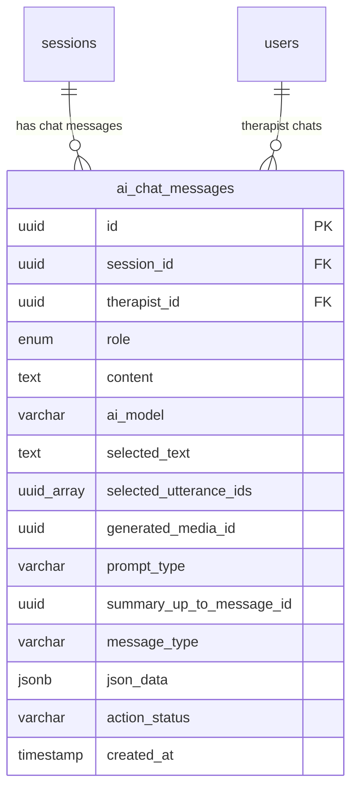

### Relationships

| Parent | Child | Cardinality | FK Column | On Delete |
|---|---|---|---|---|
| sessions | ai_chat_messages | 1:N | `session_id` | CASCADE |
| users | ai_chat_messages | 1:N | `therapist_id` | - |

---

## Media & Assets

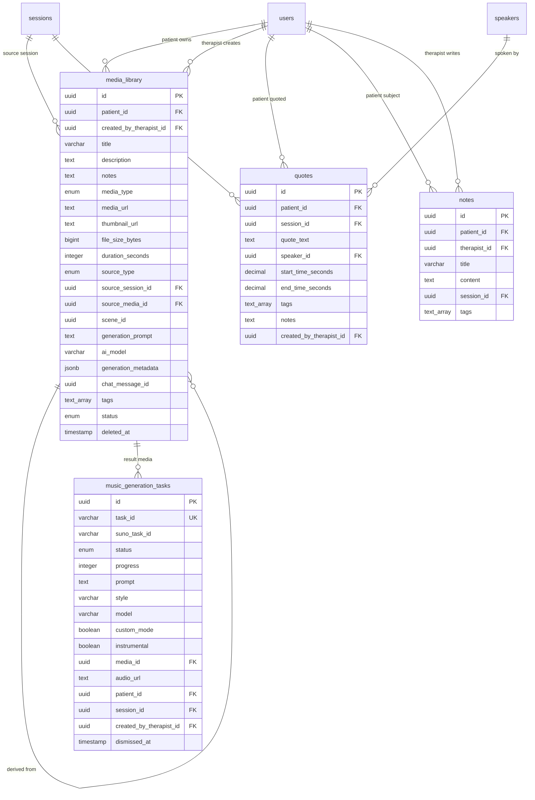

### Relationships

| Parent | Child | Cardinality | FK Column | On Delete |
|---|---|---|---|---|
| users (patient) | media_library | 1:N | `patient_id` | - |
| users (therapist) | media_library | 1:N | `created_by_therapist_id` | - |
| sessions | media_library | 1:N | `source_session_id` | - |
| media_library | media_library | 1:N (self) | `source_media_id` | - |
| media_library | music_generation_tasks | 1:1 | `media_id` | - |
| users | music_generation_tasks | 1:N | `patient_id` | - |
| users | music_generation_tasks | 1:N | `created_by_therapist_id` | - |
| sessions | music_generation_tasks | 1:N | `session_id` | - |
| users | quotes | 1:N | `patient_id` | - |
| sessions | quotes | 1:N | `session_id` | - |
| speakers | quotes | 1:N | `speaker_id` | - |
| users | quotes | 1:N | `created_by_therapist_id` | - |
| users | notes | 1:N | `patient_id` | - |
| users | notes | 1:N | `therapist_id` | - |
| sessions | notes | 1:N | `session_id` | - |

---

## Templates & Modules

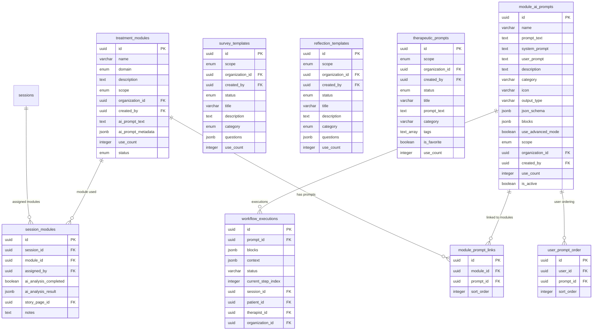

### Relationships

| Parent | Child | Cardinality | FK Column | On Delete |
|---|---|---|---|---|
| treatment_modules | module_prompt_links | 1:N | `module_id` | CASCADE |
| module_ai_prompts | module_prompt_links | 1:N | `prompt_id` | CASCADE |
| users | user_prompt_order | 1:N | `user_id` | CASCADE |
| module_ai_prompts | user_prompt_order | 1:N | `prompt_id` | CASCADE |
| sessions | session_modules | 1:N | `session_id` | CASCADE |
| treatment_modules | session_modules | 1:N | `module_id` | SET NULL |
| users | session_modules | N:1 | `assigned_by` | - |
| story_pages | session_modules | 1:1 | `story_page_id` | - |
| module_ai_prompts | workflow_executions | 1:N | `prompt_id` | CASCADE |
| sessions | workflow_executions | 1:N | `session_id` | CASCADE |
| users | workflow_executions | 1:N | `patient_id` | CASCADE |
| users | workflow_executions | 1:N | `therapist_id` | CASCADE |
| organizations | workflow_executions | 1:N | `organization_id` | CASCADE |
| organizations | survey_templates | 1:N | `organization_id` | CASCADE |
| users | survey_templates | 1:N | `created_by` | - |
| organizations | reflection_templates | 1:N | `organization_id` | CASCADE |
| users | reflection_templates | 1:N | `created_by` | - |
| organizations | therapeutic_prompts | 1:N | `organization_id` | CASCADE |
| users | therapeutic_prompts | 1:N | `created_by` | - |

---

## Email

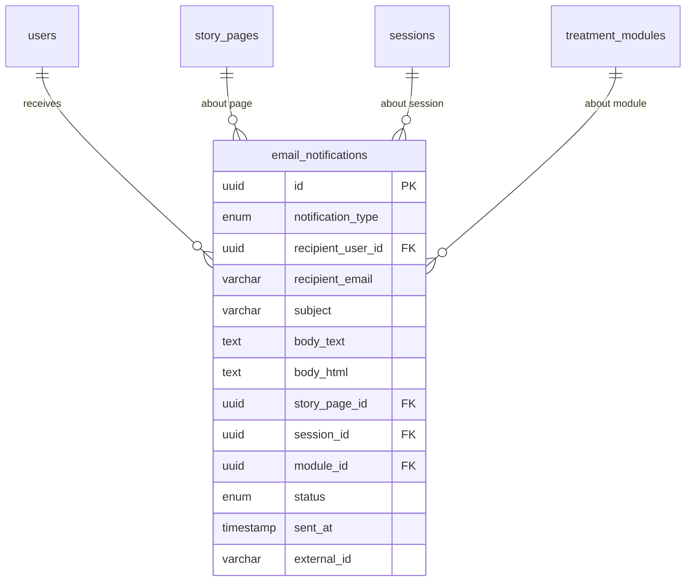

### Relationships

| Parent | Child | Cardinality | FK Column | On Delete |
|---|---|---|---|---|
| users | email_notifications | 1:N | `recipient_user_id` | - |
| story_pages | email_notifications | 1:N | `story_page_id` | - |
| sessions | email_notifications | 1:N | `session_id` | - |
| treatment_modules | email_notifications | 1:N | `module_id` | - |

---

## Scenes & Video

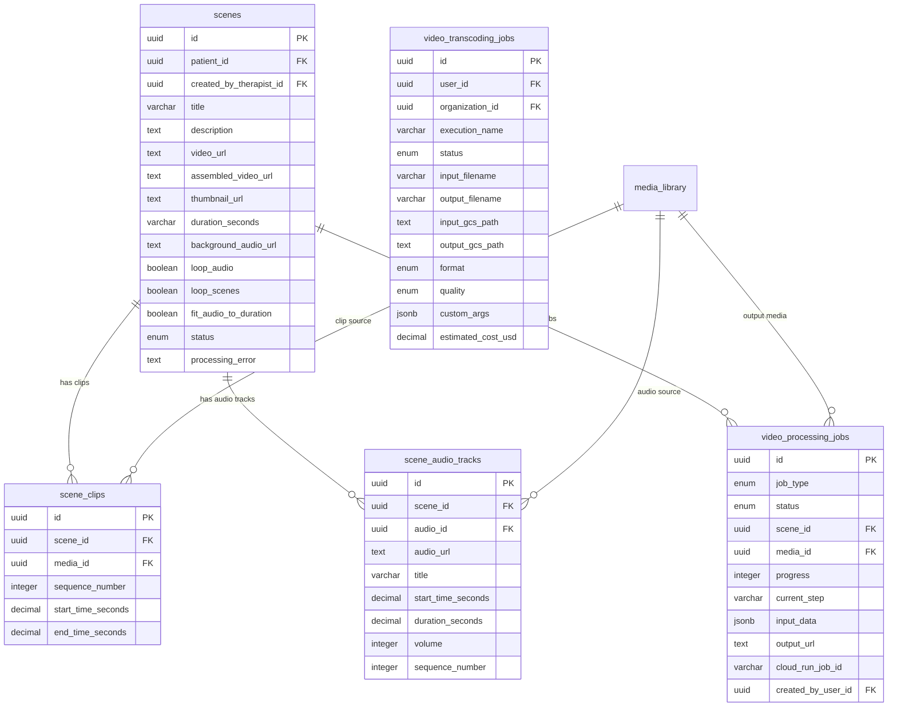

### Relationships

| Parent | Child | Cardinality | FK Column | On Delete |
|---|---|---|---|---|
| users (patient) | scenes | 1:N | `patient_id` | - |
| users (therapist) | scenes | 1:N | `created_by_therapist_id` | - |
| scenes | scene_clips | 1:N | `scene_id` | CASCADE |
| media_library | scene_clips | 1:N | `media_id` | - |
| scenes | scene_audio_tracks | 1:N | `scene_id` | CASCADE |
| media_library | scene_audio_tracks | 1:N | `audio_id` | - |
| scenes | video_processing_jobs | 1:N | `scene_id` | CASCADE |
| media_library | video_processing_jobs | 1:N | `media_id` | SET NULL |
| users | video_processing_jobs | 1:N | `created_by_user_id` | - |
| users | video_transcoding_jobs | 1:N | `user_id` | - |
| organizations | video_transcoding_jobs | 1:N | `organization_id` | - |

---

## Story Pages

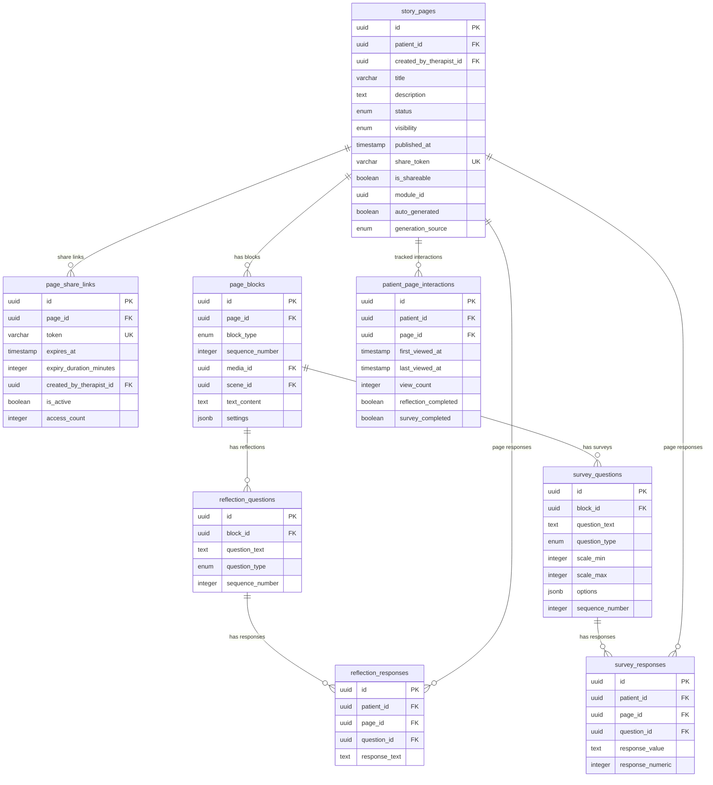

### Relationships

| Parent | Child | Cardinality | FK Column | On Delete |
|---|---|---|---|---|
| users (patient) | story_pages | 1:N | `patient_id` | - |
| users (therapist) | story_pages | 1:N | `created_by_therapist_id` | - |
| story_pages | page_share_links | 1:N | `page_id` | CASCADE |
| users | page_share_links | 1:N | `created_by_therapist_id` | - |
| story_pages | page_blocks | 1:N | `page_id` | CASCADE |
| media_library | page_blocks | 1:N | `media_id` | - |
| scenes | page_blocks | 1:N | `scene_id` | - |
| page_blocks | reflection_questions | 1:N | `block_id` | CASCADE |
| page_blocks | survey_questions | 1:N | `block_id` | CASCADE |
| users | reflection_responses | 1:N | `patient_id` | - |
| story_pages | reflection_responses | 1:N | `page_id` | - |
| reflection_questions | reflection_responses | 1:N | `question_id` | - |
| users | survey_responses | 1:N | `patient_id` | - |
| story_pages | survey_responses | 1:N | `page_id` | - |
| survey_questions | survey_responses | 1:N | `question_id` | - |
| users | patient_page_interactions | 1:N | `patient_id` | - |
| story_pages | patient_page_interactions | 1:N | `page_id` | - |

---

## Recordings

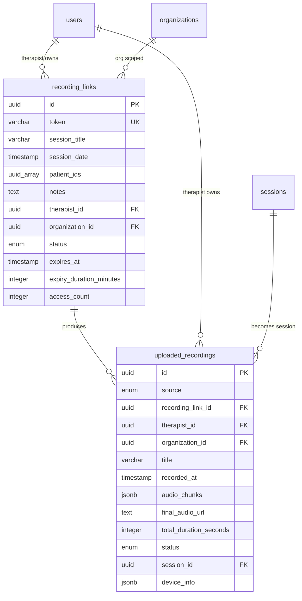

### Relationships

| Parent | Child | Cardinality | FK Column | On Delete |
|---|---|---|---|---|
| users | recording_links | 1:N | `therapist_id` | - |
| organizations | recording_links | 1:N | `organization_id` | - |
| recording_links | uploaded_recordings | 1:N | `recording_link_id` | SET NULL |
| users | uploaded_recordings | 1:N | `therapist_id` | - |
| organizations | uploaded_recordings | 1:N | `organization_id` | - |
| sessions | uploaded_recordings | 1:N | `session_id` | SET NULL |

---

## AI Models

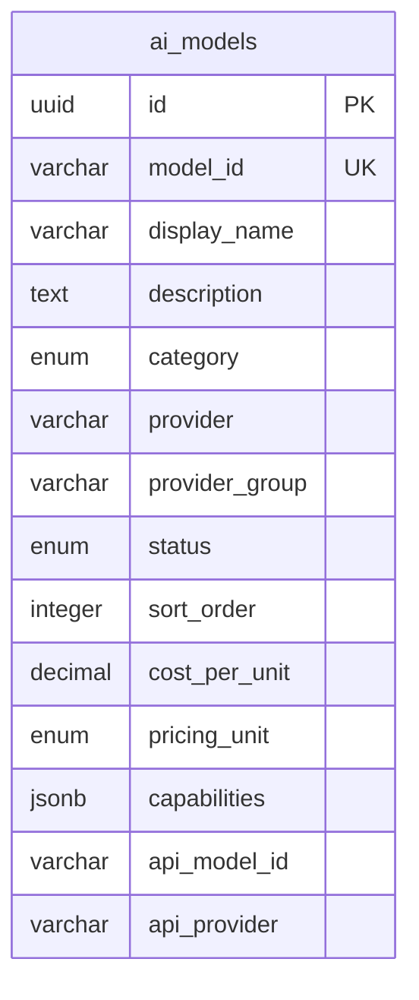

> [!TIP]
> The `ai_models` table is a standalone registry with no foreign key relationships. It stores model metadata, pricing, and capabilities for the provider abstraction layer.

---

## Clinical Assessments

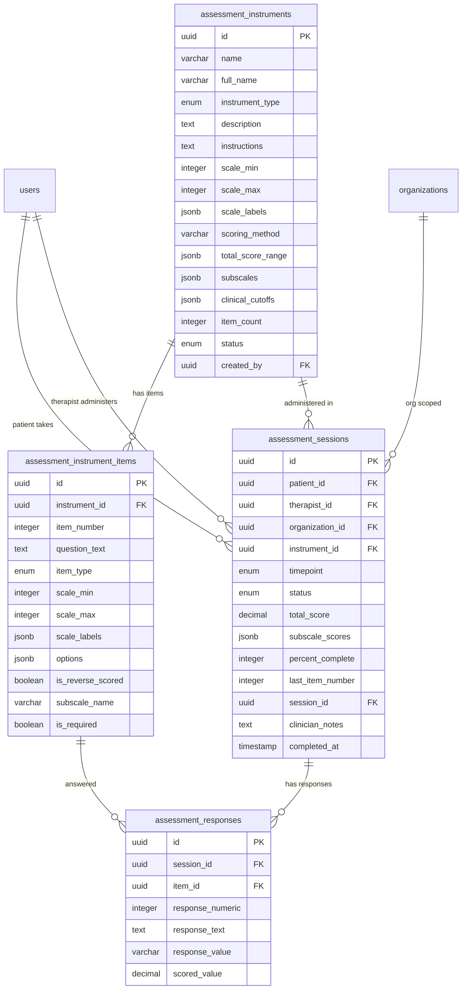

### Relationships

| Parent | Child | Cardinality | FK Column | On Delete |
|---|---|---|---|---|
| assessment_instruments | assessment_instrument_items | 1:N | `instrument_id` | CASCADE |
| assessment_instruments | assessment_sessions | 1:N | `instrument_id` | - |
| users (patient) | assessment_sessions | 1:N | `patient_id` | - |
| users (therapist) | assessment_sessions | 1:N | `therapist_id` | - |
| organizations | assessment_sessions | 1:N | `organization_id` | - |
| sessions | assessment_sessions | 1:N | `session_id` | - |
| assessment_sessions | assessment_responses | 1:N | `session_id` | CASCADE |
| assessment_instrument_items | assessment_responses | 1:N | `item_id` | - |
| users | assessment_instruments | 1:N | `created_by` | - |

---

## Platform

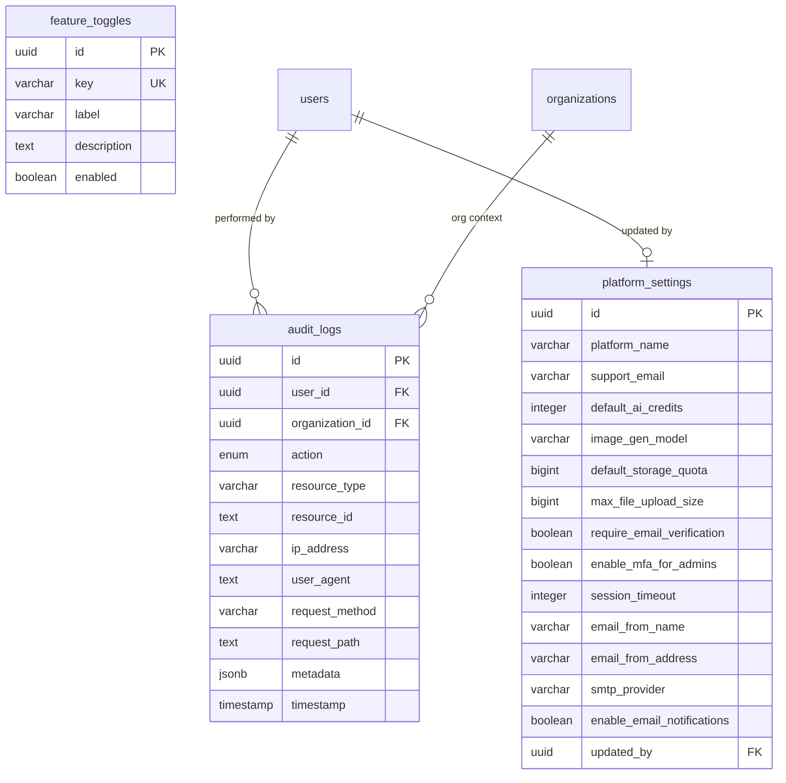

### Relationships

| Parent | Child | Cardinality | FK Column | On Delete |
|---|---|---|---|---|
| users | audit_logs | 1:N | `user_id` | - |
| organizations | audit_logs | 1:N | `organization_id` | SET NULL |
| users | platform_settings | 1:1 | `updated_by` | - |

---

*Last updated: 2026-02-19*
