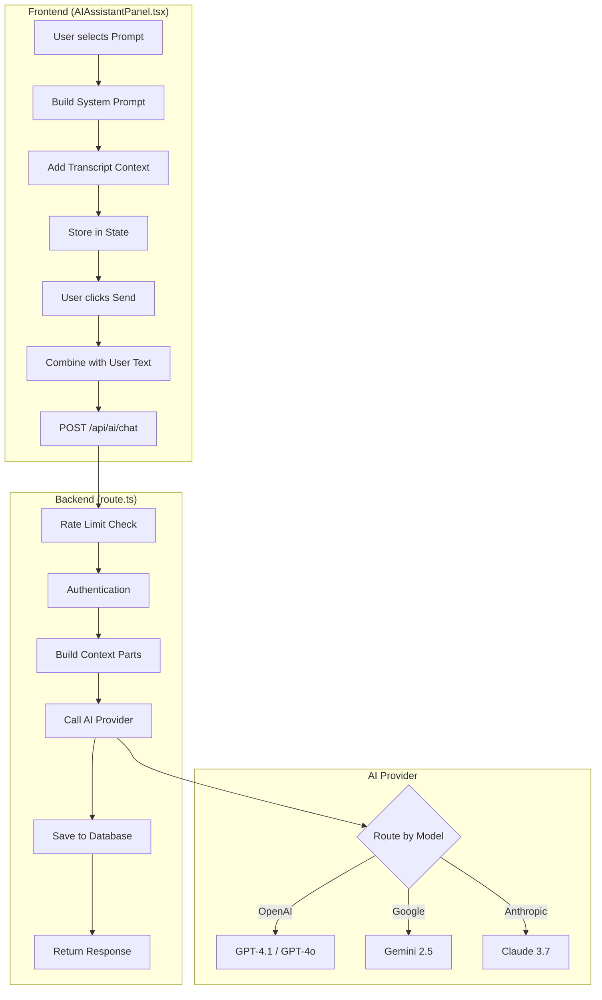
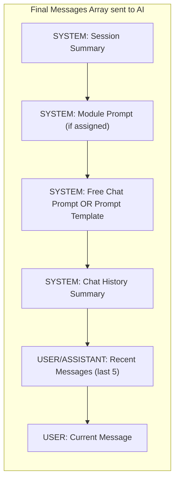
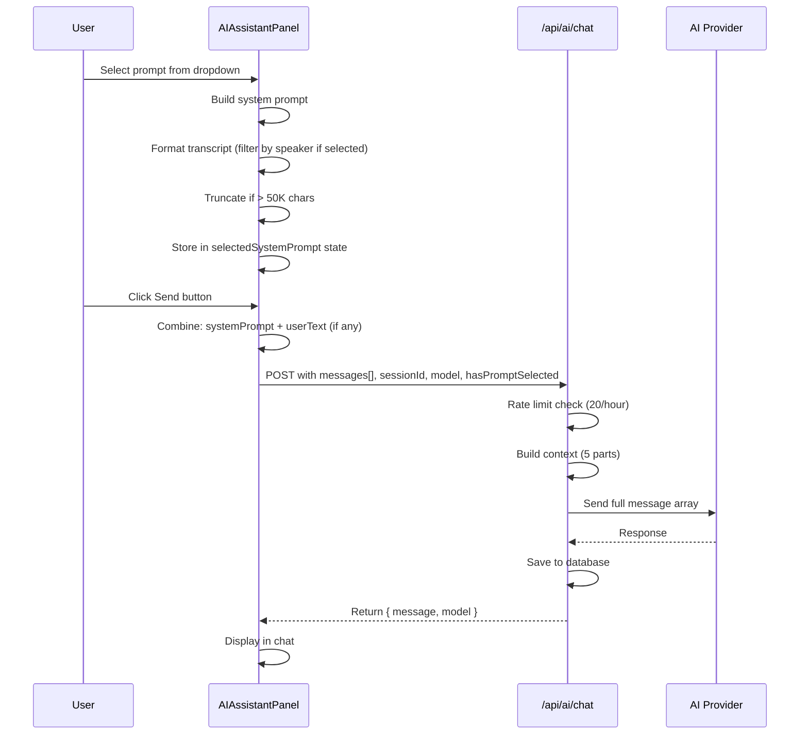

# AI Chat Flow Documentation

This document explains what gets sent to the AI when using the chat feature in the Transcript Viewer.

---

## High-Level Flow Diagram



---

## Available AI Models

### Dropdown Options (Frontend)

| Provider | Model ID | Display Name |
|----------|----------|--------------|
| **OpenAI** | `gpt-4.1` | GPT-4.1 |
| | `gpt-4.1-mini` | GPT-4.1 Mini |
| | `gpt-4.1-nano` | GPT-4.1 Nano |
| | `gpt-4o` | GPT-4o |
| | `gpt-4o-mini` | GPT-4o Mini |
| | `gpt-3.5-turbo` | GPT-3.5 Turbo |
| **Anthropic** | `claude-haiku-4` | Claude Haiku 4 |
| | `claude-3.7-sonnet` | Claude 3.7 Sonnet |
| **Google** | `gemini-2.5-flash` | Gemini 2.5 Flash **(Default)** |
| | `gemini-2.5-pro` | Gemini 2.5 Pro |

### All Supported Models (Backend)

**OpenAI:**
- `gpt-4.1`, `gpt-4.1-mini`, `gpt-4.1-nano`
- `gpt-4o`, `gpt-4o-mini`
- `gpt-4-turbo`, `gpt-3.5-turbo`
- `o3-mini`, `o3`, `o3-pro`
- `o1-pro`, `o1`, `o1-mini`

**Google Gemini:**
- `gemini-2.5-pro`, `gemini-2.5-flash`, `gemini-2.5-flash-lite`
- `gemini-2.0-flash`, `gemini-2.0-flash-lite`
- `gemini-1.5-pro`, `gemini-1.5-flash`

---

## What Gets Sent to the AI

### Complete Message Structure



### Message Parts Explained

#### Part 1: Session Summary (Cached)
```
# Session Summary
- Patient: [Name]
- Date: [Session Date]
- Duration: [Duration]
- Session Overview: Brief description
- Key Themes: [High-level themes, NO quotes]
- Emotional Tone: Overall atmosphere
- Clinical Observations: Progress notes
- Treatment Focus: Session goals
```

**Note:** Session summaries intentionally exclude verbatim quotes to respect participant filtering. When a user selects "Only Patient" or "Only Therapist", they should only see content from that speaker.

#### Part 2: Module Prompt (If Assigned)
```
# Treatment Module: [Module Name]

**Domain:** [e.g., Anxiety, Depression, Trauma]
**Therapeutic Aim:** [Module description]

## Module-Specific Analysis Instructions:
[AI prompt text from the module]

**Important:** Use these module-specific instructions to guide your analysis.
```

#### Part 3: System Prompt (Two Modes)

**Mode A: Free Chat (No Prompt Selected)**
```
You are an expert therapeutic assistant specialized in narrative therapy.

## THIS IS FREE CHAT MODE

**CRITICAL RESPONSE FORMAT RULE:**
You are in FREE CHAT mode. You MUST ONLY respond with plain text or markdown.
- NEVER output JSON
- NEVER output { } or any JSON-like structures
...
```

**Mode B: Prompt Selected (e.g., "Potential Images")**
```
[Selected Prompt's System Text]

---

**Session Transcript** (All Participants):

[00:01] **Dr. Smith** (Therapist): Welcome to our session today...
[00:15] **John** (Patient): Thank you. I've been thinking about...
...
```

#### Part 4: Chat Summary (Cached, Regenerated Every 10 Messages)
```
# Previous Conversation Summary

The therapist discussed anxiety triggers with the patient...
Key points covered:
- Patient's sleep patterns
- Work-related stress
...
```

#### Part 5: Recent Messages (Last 5)
```
[Previous conversation messages for context]
```

#### Part 6: Current User Message
```
[User's typed message OR "Analyzing with [Prompt Name]..."]
```

---

## Prompt Selection Flow



---

## Transcript Context Building

### Speaker Filtering Options

| Selection | What Gets Included |
|-----------|-------------------|
| **All Participants** | All utterances from transcript |
| **Therapist (You)** | Only therapist's utterances |
| **[Patient Name]** | Only that patient's utterances |

### Transcript Format

```
[00:01] **Dr. Smith** (Therapist): Welcome to our session today...
[00:15] **John** (Patient): Thank you. I've been thinking about what we discussed last time...
[00:45] **Dr. Smith** (Therapist): That's great to hear. Can you tell me more about...
```

### Truncation
- Max length: 50,000 characters (~12,500 words)
- If exceeded: Shows `[... transcript truncated for length. X characters omitted ...]`

---

## API Request Structure

### POST /api/ai/chat

**Request Body:**
```typescript
{
  messages: [
    { role: 'user', content: 'Full prompt with transcript context' }
  ],
  sessionId: 'uuid-of-session',
  model: 'gemini-2.5-flash',          // Selected model
  hasPromptSelected: true,             // Skip free chat system prompt
  selectedText?: string,               // Optional: highlighted text
  selectedUtteranceIds?: string[]      // Optional: specific utterance IDs
}
```

**Response:**
```typescript
{
  message: 'AI response text...',
  model: 'gemini-2.5-flash'            // Model that was used
}
```

---

## Visual Summary

```
┌─────────────────────────────────────────────────────────────────┐
│                     WHAT AI RECEIVES                            │
├─────────────────────────────────────────────────────────────────┤
│                                                                 │
│  ┌──────────────────────────────────────────────────────────┐  │
│  │ SYSTEM MESSAGE 1: Session Summary                        │  │
│  │ - Patient info, date, duration, key themes               │  │
│  │ - NO verbatim quotes (respects participant filtering)    │  │
│  └──────────────────────────────────────────────────────────┘  │
│                              ↓                                  │
│  ┌──────────────────────────────────────────────────────────┐  │
│  │ SYSTEM MESSAGE 2: Module Prompt (if assigned)            │  │
│  │ - Treatment module name, domain, AI instructions         │  │
│  └──────────────────────────────────────────────────────────┘  │
│                              ↓                                  │
│  ┌──────────────────────────────────────────────────────────┐  │
│  │ SYSTEM MESSAGE 3: Mode-specific prompt                   │  │
│  │                                                          │  │
│  │  IF no prompt selected:                                  │  │
│  │    → "Free Chat" rules (no JSON, conversational)         │  │
│  │                                                          │  │
│  │  IF prompt selected (e.g., "Potential Images"):          │  │
│  │    → Prompt template text                                │  │
│  │    → Full session transcript (filtered by speaker)       │  │
│  └──────────────────────────────────────────────────────────┘  │
│                              ↓                                  │
│  ┌──────────────────────────────────────────────────────────┐  │
│  │ SYSTEM MESSAGE 4: Chat History Summary                   │  │
│  │ - Summary of previous conversation (regenerated/10 msgs) │  │
│  └──────────────────────────────────────────────────────────┘  │
│                              ↓                                  │
│  ┌──────────────────────────────────────────────────────────┐  │
│  │ RECENT MESSAGES (last 5)                                 │  │
│  │ - Previous user/assistant exchanges                      │  │
│  └──────────────────────────────────────────────────────────┘  │
│                              ↓                                  │
│  ┌──────────────────────────────────────────────────────────┐  │
│  │ USER MESSAGE: Current request                            │  │
│  │ - User's typed text OR "Analyzing with [Prompt Name]..." │  │
│  └──────────────────────────────────────────────────────────┘  │
│                                                                 │
└─────────────────────────────────────────────────────────────────┘
```

---

## Key Files

| File | Purpose |
|------|---------|
| `src/app/(auth)/sessions/[id]/transcript/components/AIAssistantPanel.tsx` | Frontend chat UI, prompt selection, message sending |
| `src/app/api/ai/chat/route.ts` | API endpoint, context building, provider routing |
| `src/libs/TextGeneration.ts` | Model routing abstraction |
| `src/libs/providers/OpenAIChat.ts` | OpenAI provider implementation |
| `src/libs/providers/GeminiChat.ts` | Google Gemini provider implementation |
| `src/utils/TranscriptFormatter.ts` | Formats transcript for AI context |
| `src/services/SessionSummaryService.ts` | Generates/caches session summaries |
| `src/services/ChatSummaryService.ts` | Manages chat history summaries |

---

## Rate Limiting

- **Limit:** 20 requests per hour per IP
- **Error:** HTTP 429 with `retryAfter` seconds
- **Implementation:** `src/utils/RateLimiter.ts`

---

## HIPAA Compliance

- All AI interactions are logged via `logPHIAccess()`
- Chat messages saved to `aiChatMessages` table
- Session access verified via `requireSessionAccess()`
- Therapist authentication required via `requireTherapist()`
