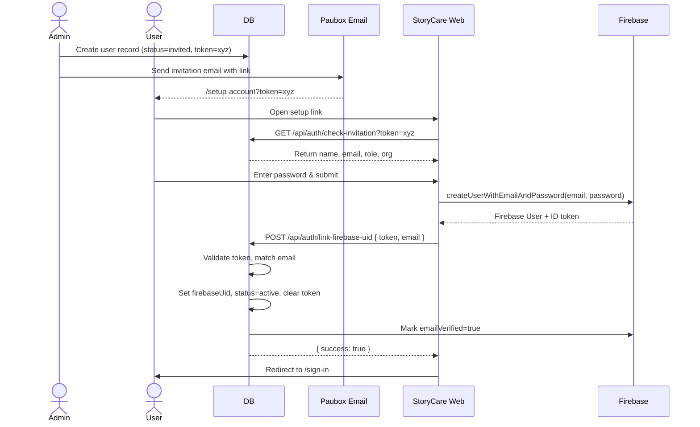
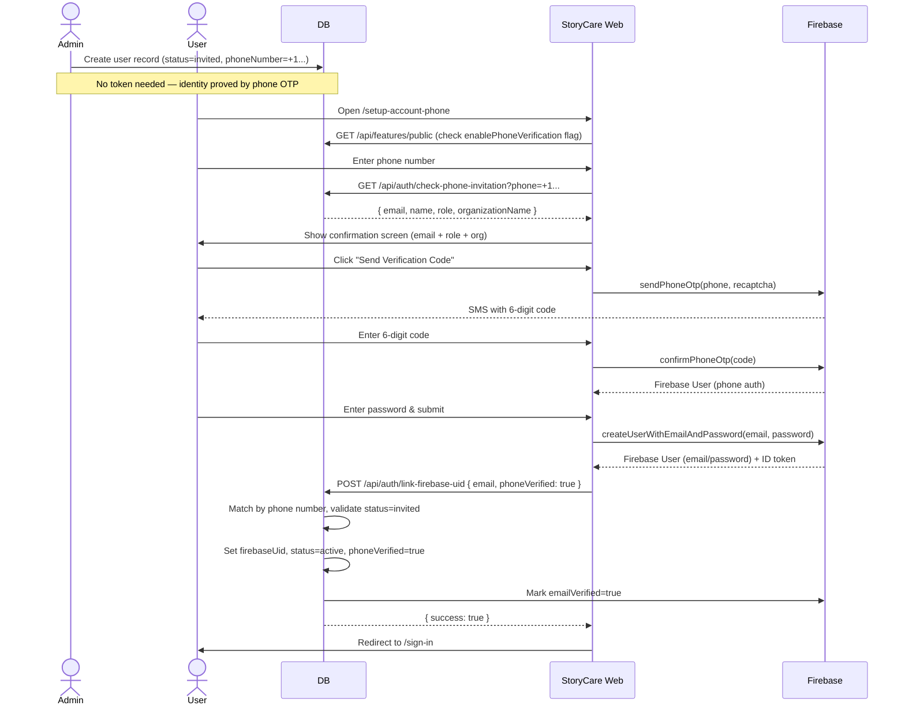
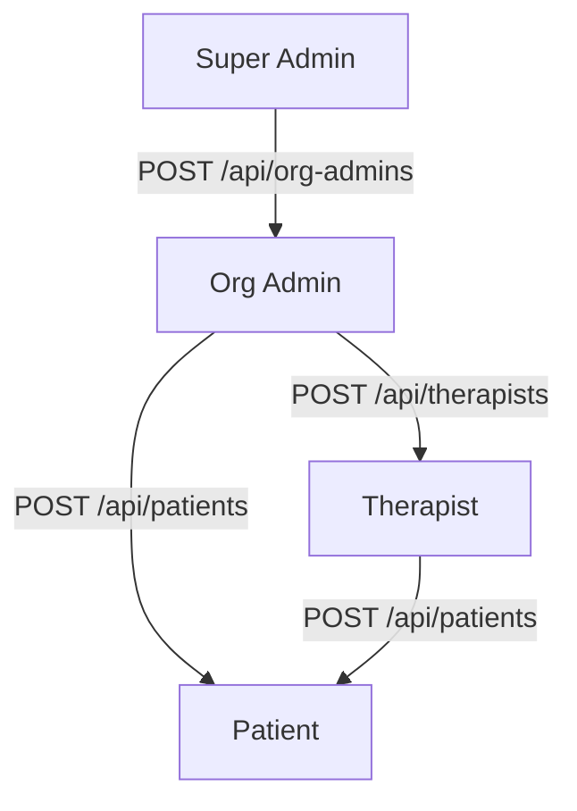
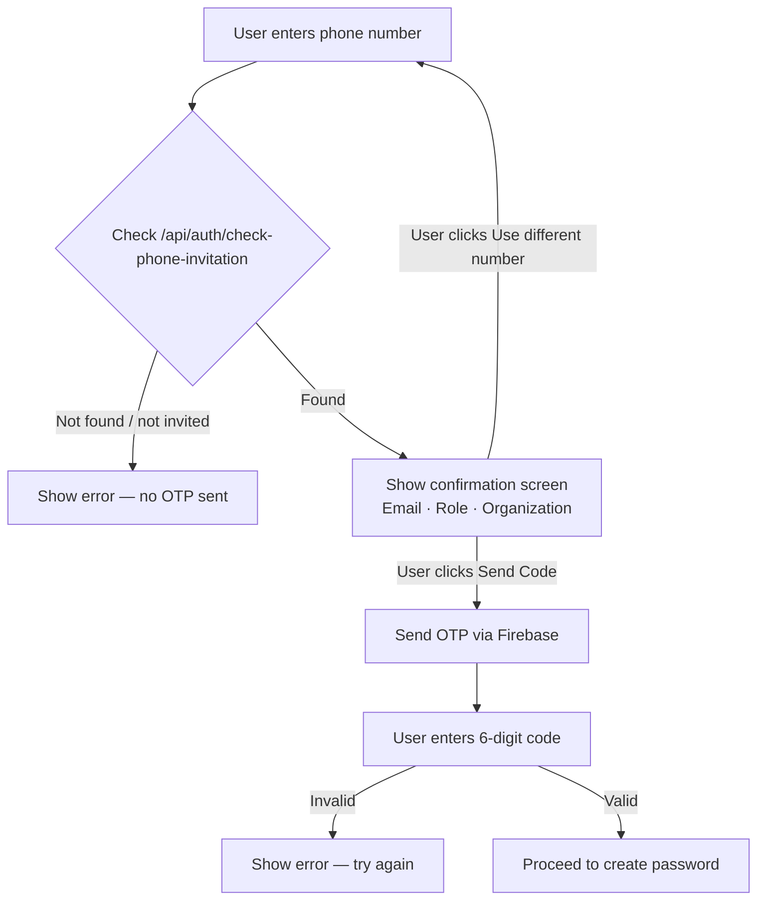

# StoryCare — Invitation & Account Setup Flows

> How users are invited to the platform and how they activate their accounts.

---

## User Roles

```
Super Admin
  └── invites → Org Admin
                  └── invites → Therapist
                                  └── invites → Patient
```

| Role | Invited by | Setup method |
|---|---|---|
| Org Admin | Super Admin | Email (token link) |
| Therapist | Org Admin | Email (token link) or Phone (OTP) |
| Patient | Therapist | Email (token link) or Phone (OTP) |

---

## Flow 1 — Email / Token Setup

Used when the user is invited **with an email address** and receives a setup link.



---

## Flow 2 — Phone / OTP Setup

Used when the user is invited **with a phone number** and no email token is required.



---

## Database State Transitions

```
User Record Lifecycle
─────────────────────

[invited]
  - firebaseUid: null
  - status: 'invited'
  - invitationToken: 'abc123' (email flow) or null (phone flow)
  - phoneNumber: '+1...' (phone flow) or null

        │
        │  User completes setup
        ▼

[active]
  - firebaseUid: 'firebase-uid-xyz'
  - status: 'active'
  - invitationToken: null (cleared)
  - phoneVerified: true (phone flow only)
```

---

## Who Can Invite Whom



### Invitation API Summary

| Endpoint | Caller | Creates |
|---|---|---|
| `POST /api/org-admins` | Super Admin | Org Admin |
| `POST /api/therapists` | Org Admin or Super Admin | Therapist |
| `POST /api/patients` | Therapist, Org Admin, or Super Admin | Patient |

---

## Pre-Check: Phone Invitation Validation

Before any OTP is sent, the phone number is validated against the database.



---

## Security Notes

- **Phone flow**: No invitation token required — ownership is proved by receiving and entering the SMS OTP.
- **Email flow**: Token is single-use and expires in **7 days**. Cleared from DB on activation.
- **Duplicate prevention**: `link-firebase-uid` checks `firebaseUid IS NULL` before activating. Returns `409` if already active.
- **Organization boundary**: Each user is scoped to a single `organizationId`. Admins cannot see or manage users outside their org.
- **HIPAA audit**: All PHI access is logged to the `audit_logs` table.
