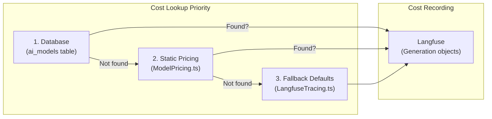

# AI Providers

> StoryCare's multi-provider AI architecture -- text generation, image/video creation, music synthesis, and speech transcription with centralized cost tracking via Langfuse.

---

## Provider Matrix

| Capability | Primary Provider | Models | API Layer | Pricing Unit |
|---|---|---|---|---|
| **Text Generation** | Google Gemini | 7 models (2.5 Pro, 2.5 Flash, 2.0 Flash, etc.) | `src/libs/TextGeneration.ts` | Per 1K tokens |
| **Text-to-Image** | Atlas Cloud | 80+ models (Flux, Seedream, Imagen, Ideogram, etc.) | `src/libs/ImageGeneration.ts` | Per image |
| **Image-to-Image** | Atlas Cloud | 60+ models (Kontext, Edit, Upscaling, Style Transfer) | `src/libs/ImageGeneration.ts` | Per image |
| **Text-to-Video** | Atlas Cloud | 30+ models (Veo, Sora, Kling, Seedance, etc.) | `src/libs/VideoGeneration.ts` | Per second |
| **Image-to-Video** | Atlas Cloud | 40+ models (Veo, Kling, Hailuo, Pika, etc.) | `src/libs/VideoGeneration.ts` | Per second |
| **Music Generation** | Suno | 5 models (V4, V4.5, V4.5 Plus, V4.5 All, V5) | `src/libs/MusicGeneration.ts` | Per minute |
| **Transcription** | Deepgram | 4 models (Nova 2, Nova, Enhanced, Base) | `src/libs/Deepgram.ts` | Per minute |
| **Image-to-Text** | Google Gemini | Same as text generation (multimodal) | `src/libs/TextGeneration.ts` | Per 1K tokens |

---

## Model Categories

The `ai_models` database table organizes models into these categories (defined in `src/models/Schema.ts`):

| Category | Description | Example Models |
|---|---|---|
| `text_to_text` | Text/chat completions | Gemini 2.5 Pro, Gemini 2.5 Flash |
| `text_to_image` | Image generation from prompts | Flux 1.1 Pro Ultra, Imagen 4, Seedream 4.5 |
| `image_to_image` | Image editing, upscaling, style transfer | Flux Kontext Max, Recraft Creative Upscale |
| `text_to_video` | Video from text prompts | Veo 3.1, Sora 2, Kling 2.6 Pro |
| `image_to_video` | Video from image + prompt | Veo 3.1 I2V, Kling 2.6 Pro I2V |
| `music_generation` | Music/audio creation | Suno V4, V4.5, V5 |
| `transcription` | Speech-to-text | Deepgram Nova 2, Enhanced |
| `image_to_text` | Image understanding (multimodal) | Gemini 2.5 Pro, Gemini 2.0 Flash |

---

## Text Generation Models (Google Gemini)

All text generation uses Google Gemini via the `src/libs/TextGeneration.ts` abstraction layer.

| Model | Context | Best For |
|---|---|---|
| `gemini-2.5-pro` | 1M tokens | Complex analysis, long transcripts |
| `gemini-2.5-flash` | Speed optimized | Quick responses, real-time chat |
| `gemini-2.5-flash-lite` | Most cost-effective | Simple tasks, batch processing |
| `gemini-2.0-flash` | Next-gen | General purpose |
| `gemini-2.0-flash-lite` | Better than 1.5 | Budget tasks |
| `gemini-1.5-pro` | Legacy | Backward compatibility |
| `gemini-1.5-flash` | Legacy | Backward compatibility |

> **Note:** Langfuse has built-in automatic cost calculation for Gemini models based on token usage. No manual pricing configuration needed.

---

## Image Generation Models (Atlas Cloud)

Atlas Cloud provides a unified API for 140+ image models from multiple providers.

### Text-to-Image Highlights

| Provider Group | Models | Price Range (per image) |
|---|---|---|
| Flux (Black Forest Labs) | 12 models | $0.003 - $0.08 |
| Seedream (ByteDance) | 6 models | $0.02 - $0.038 |
| Imagen (Google) | 6 models | $0.016 - $0.048 |
| Nano Banana (Google) | 7 models | $0.01 - $0.15 |
| Ideogram | 6 models | $0.03 - $0.09 |
| Recraft | 6 models | $0.004 - $0.25 |
| Luma Photon | 4 models | $0.005 - $0.015 |
| Alibaba/Qwen | 5 models | $0.02 |
| Other (HiDream, Z-Image, etc.) | 10+ models | $0.005 - $0.10 |

### Image-to-Image Highlights

| Capability | Key Models | Price Range |
|---|---|---|
| Reference-based editing | Flux Kontext Max, Kontext Pro | $0.025 - $0.08 |
| Multi-image composition | Flux Kontext Multi variants | $0.025 - $0.08 |
| Inpainting/Outpainting | Flux Fill Dev, Image Zoom Out | $0.02 - $0.035 |
| Style transfer | 10+ style presets | $0.02 each |
| Upscaling | Real-ESRGAN, Recraft Upscale | $0.0024 - $0.25 |

---

## Video Generation Models (Atlas Cloud)

### Text-to-Video Highlights

| Tier | Key Models | Price (per second) |
|---|---|---|
| Premium | Veo 3.1, Sora 2 Pro, Kling Video O1 | $0.15 - $0.476 |
| Standard | Hailuo 2.3, PixVerse 4.5, Pika 2.2 | $0.098 - $0.28 |
| Budget | Wan 2.6, Seedance Lite, LTX 2 Fast | $0.01 - $0.07 |

### Image-to-Video Highlights

| Tier | Key Models | Price (per second) |
|---|---|---|
| Premium | Sora 2 I2V Pro, Veo 3.1 I2V, Kling 2.0 Master | $0.16 - $1.105 |
| Standard | Hailuo 2.3 I2V, Luma Ray 2, Vidu Ref 2.0 | $0.06 - $0.40 |
| Budget | Wan 2.6 I2V, Seedance Lite I2V | $0.0136 - $0.07 |

---

## Music Generation Models (Suno)

| Model | Price (per minute) | Notes |
|---|---|---|
| `V4` | $0.04 | Stable, good quality |
| `V4_5` | $0.05 | Improved quality |
| `V4_5PLUS` | $0.06 | Enhanced quality |
| `V4_5ALL` | $0.06 | All capabilities |
| `V5` | $0.08 | Latest, best quality |

Suno uses a webhook callback pattern:
1. Client calls `/api/ai/generate-music` to start generation
2. Suno sends status updates to `/api/webhooks/suno`
3. Client polls `/api/ai/music-task/[taskId]` for completion

---

## Transcription Models (Deepgram)

| Model | Price (per minute) | Best For |
|---|---|---|
| `nova-2` | $0.0043 | Best accuracy (default) |
| `nova` | $0.0035 | Good balance |
| `enhanced` | $0.0145 | Legacy premium |
| `base` | $0.0125 | Legacy basic |

> **Single-active constraint**: Only one transcription model can be active at a time, enforced by `AiModelService.updateAiModel()` and `bulkUpdateModelStatus()`.

Features used: Pre-recorded transcription, speaker diarization, smart formatting.

---

## Cost Tracking Pipeline

StoryCare uses a three-tier cost lookup system with Langfuse as the observability layer.



### Step 1: Database Lookup (Primary)

The `ai_models` table is the source of truth for pricing. Super admins can update pricing via the UI at `/super-admin/ai-models`.

```typescript
// src/services/AiModelService.ts
export async function getModelCost(modelId: string): Promise<number | null> {
  const model = await db.select().from(aiModelsSchema)
    .where(eq(aiModelsSchema.modelId, modelId)).limit(1);
  return model[0]?.costPerUnit ? parseFloat(model[0].costPerUnit) : null;
}
```

### Step 2: Static Pricing Fallback

If the model is not in the database, static pricing from `src/libs/ModelPricing.ts` is used:

- `IMAGE_MODEL_PRICING` -- 140+ image models, price per image
- `VIDEO_MODEL_PRICING` -- 80+ video models, price per second
- `TRANSCRIPTION_MODEL_PRICING` -- 4 Deepgram models, price per minute
- `MUSIC_MODEL_PRICING` -- 5 Suno models, price per minute

### Step 3: Fallback Defaults

If neither source has pricing, hardcoded defaults are used:

| Type | Fallback Cost |
|---|---|
| Image | $0.02 per image |
| Video | $0.05 per second |
| Transcription | $0.005 per minute |
| Music | $0.05 per minute |

### Langfuse Integration

All AI operations are tracked as Langfuse **Generation** objects with `usage.totalCost` for proper cost aggregation.

```typescript
// src/libs/LangfuseTracing.ts
const trace = createTrace('image-generation', {
  userId: user.dbUserId,
  patientId,
  organizationId: user.organizationId,
});

const generation = createImageGeneration(trace, 'generate-patient-image', {
  model: 'flux-1.1-pro',
  input: { prompt, referenceImages },
});

// After completion -- async cost lookup (DB -> static -> fallback)
await endImageGeneration(generation, 'flux-1.1-pro', {
  output: { imageUrl },
  imageCount: 1,
});
```

Trace metadata includes: `userId`, `firebaseUid`, `userEmail`, `userRole`, `organizationId`, `patientId`, `patientName`, `sessionId`.

> **Note:** For text models (Gemini), Langfuse automatically calculates costs from model name and token counts. Manual cost tracking is only needed for image, video, music, and transcription.

---

## Database Seeding

The `scripts/seed-ai-models.ts` script populates the `ai_models` table from `ModelMetadata.ts` and `ModelPricing.ts`:

```bash
npx tsx scripts/seed-ai-models.ts
```

This script:
1. Reads model definitions from `src/libs/ModelMetadata.ts`
2. Reads pricing from `src/libs/ModelPricing.ts`
3. Inserts or updates models in the `ai_models` table
4. Preserves existing `status` values (admin may have disabled models)
5. Creates a `system@storycare.health` user if needed

---

## Key Source Files

| File | Purpose |
|---|---|
| `src/libs/ModelMetadata.ts` | Client-safe model definitions (names, capabilities) |
| `src/libs/ModelPricing.ts` | Static pricing data (fallback) |
| `src/libs/LangfuseTracing.ts` | Cost calculation + Langfuse generation tracking |
| `src/libs/Langfuse.ts` | Langfuse client singleton |
| `src/services/AiModelService.ts` | Database CRUD for AI models (14 exported functions) |
| `src/libs/TextGeneration.ts` | Text generation abstraction (Gemini) |
| `src/libs/ImageGeneration.ts` | Image generation abstraction (Atlas Cloud) |
| `src/libs/VideoGeneration.ts` | Video generation abstraction (Atlas Cloud) |
| `src/libs/Deepgram.ts` | Deepgram transcription client |
| `scripts/seed-ai-models.ts` | Database seeding script |
