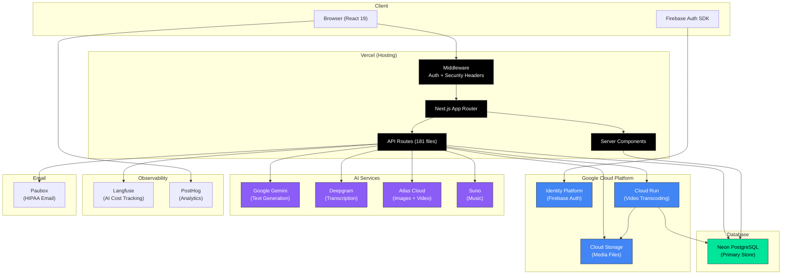
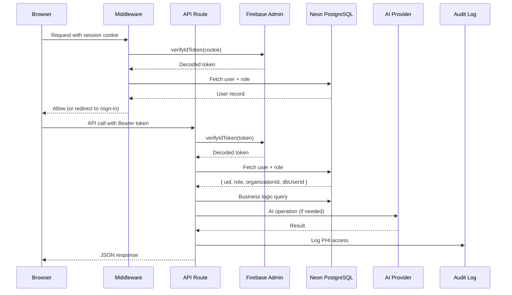

# Infrastructure Overview

> StoryCare's cloud infrastructure -- a multi-provider architecture optimized for HIPAA compliance, AI-powered features, and cost-efficient scaling.

---

## Service Grid

| Service | Provider | Purpose | HIPAA BAA? | Cost Tier |
|---|---|---|---|---|
| Hosting | **Vercel** (Enterprise) | App hosting, Edge functions, CDN | Yes (with Enterprise plan) | $$$ |
| Database | **Neon** (Serverless PostgreSQL) | Primary data store, connection pooling | Yes | $$ |
| Auth | **Firebase / Identity Platform** | Authentication, MFA, session management | Yes (with signed BAA) | $ |
| Object Storage | **Google Cloud Storage** | Media files, audio uploads, generated assets | Yes (with signed BAA) | $ |
| Video Processing | **Google Cloud Run** | GPU-accelerated FFmpeg transcoding | Yes (with signed BAA) | $$ (pay-per-use) |
| AI Text Generation | **Google Gemini** | Chat analysis, session summaries, prompt generation | Yes (with signed BAA) | $$ |
| AI Transcription | **Deepgram** | Speech-to-text with speaker diarization | Requires BAA | $$ |
| AI Images | **Atlas Cloud** | Image generation (Flux, Imagen, Seedream, etc.) | No (no PHI sent) | $$$ |
| AI Video | **Atlas Cloud** | Video generation (Veo, Kling, Sora, etc.) | No (no PHI sent) | $$$$ |
| AI Music | **Suno** | Music generation for story pages | No (no PHI sent) | $$ |
| Email | **Paubox** | HIPAA-compliant transactional email | Yes | $$ |
| Analytics | **PostHog** | Product analytics, feature flags | Requires BAA | $ |
| Support | **Intercom** | In-app customer support widget | Requires BAA | $$ |
| Observability | **Langfuse** | AI cost tracking, trace monitoring | Self-hosted option | $ |
| Local Dev DB | **PGlite** | In-memory PostgreSQL for development | N/A | Free |

> **Important:** AI media generation services (Atlas Cloud, Suno) do not receive PHI. Prompts are constructed from therapist input, not raw patient data.

---

## Architecture Diagram

---

## Connection & Scaling Configuration

### Database Connection Pooling

| Environment | Max Connections | Idle Timeout | Provider |
|---|---|---|---|
| Development | 5 | 30s | PGlite (in-memory) |
| Production | 10 | 30s | Neon PostgreSQL |
| Cloud Run | 10 | 30s (scale-to-zero optimized) | Neon PostgreSQL |

Configuration: `src/utils/DBConnection.ts`

### Cloud Run Video Processing

- **Trigger**: API route creates a `video_processing_jobs` record and triggers Cloud Run
- **Scaling**: Scale-to-zero (no cost when idle)
- **Container**: Standalone Docker build with FFmpeg
- **Status Polling**: `useVideoJobPolling` hook on the client

---

## Request Flow

---

## Environment Variable Groups

| Group | Variables | Where Set |
|---|---|---|
| Firebase Client | `NEXT_PUBLIC_FIREBASE_*` (6 vars) | Vercel + `.env.local` |
| Firebase Admin | `FIREBASE_SERVICE_ACCOUNT_KEY` or `FIREBASE_ADMIN_*` (3 vars) | Vercel |
| Database | `DATABASE_URL` | Vercel |
| Google Cloud | `GCS_*` (4 vars), `GOOGLE_CLOUD_*` (2 vars) | Vercel |
| AI Services | `DEEPGRAM_API_KEY`, `OPENAI_API_KEY` | Vercel |
| Atlas Cloud | `ATLASCLOUD_API_KEY` | Vercel |
| Suno | `SUNO_API_KEY`, `SUNO_CALLBACK_URL` | Vercel |
| Email | `PAUBOX_API_KEY`, `PAUBOX_API_USER` | Vercel |
| Analytics | `NEXT_PUBLIC_POSTHOG_*` | Vercel |
| Observability | `LANGFUSE_*` (3 vars) | Vercel |
| App Config | `NEXT_PUBLIC_APP_URL`, `NEXT_PUBLIC_APP_NAME` | Vercel + `.env.local` |

---

## Scaling Targets

| Users | Focus Area | Key Strategies |
|---|---|---|
| **1K** | Simplicity | Default Neon free tier, minimal caching |
| **10K** | Efficiency | Implement edge caching, optimize queries, Langfuse cost monitoring |
| **100K** | Architecture | Connection pooling tuning, Cloud Run auto-scaling, CDN optimization, background job queues |

---

## Key Configuration Files

| File | Purpose |
|---|---|
| `src/libs/DB.ts` | Database client singleton |
| `src/utils/DBConnection.ts` | Connection pooling configuration |
| `src/libs/Firebase.ts` | Firebase client SDK config |
| `src/libs/FirebaseAdmin.ts` | Firebase Admin SDK + role resolution |
| `src/libs/GCS.ts` | Google Cloud Storage client |
| `src/libs/Deepgram.ts` | Deepgram transcription client |
| `src/libs/TextGeneration.ts` | Text generation abstraction |
| `src/libs/ImageGeneration.ts` | Image generation abstraction |
| `src/libs/VideoGeneration.ts` | Video generation abstraction |
| `src/libs/Paubox.ts` | HIPAA-compliant email client |
| `src/libs/Langfuse.ts` | Langfuse observability client |
| `src/libs/LangfuseTracing.ts` | AI cost tracking helpers |
| `src/libs/Env.ts` | Environment variable validation (T3 Env) |
