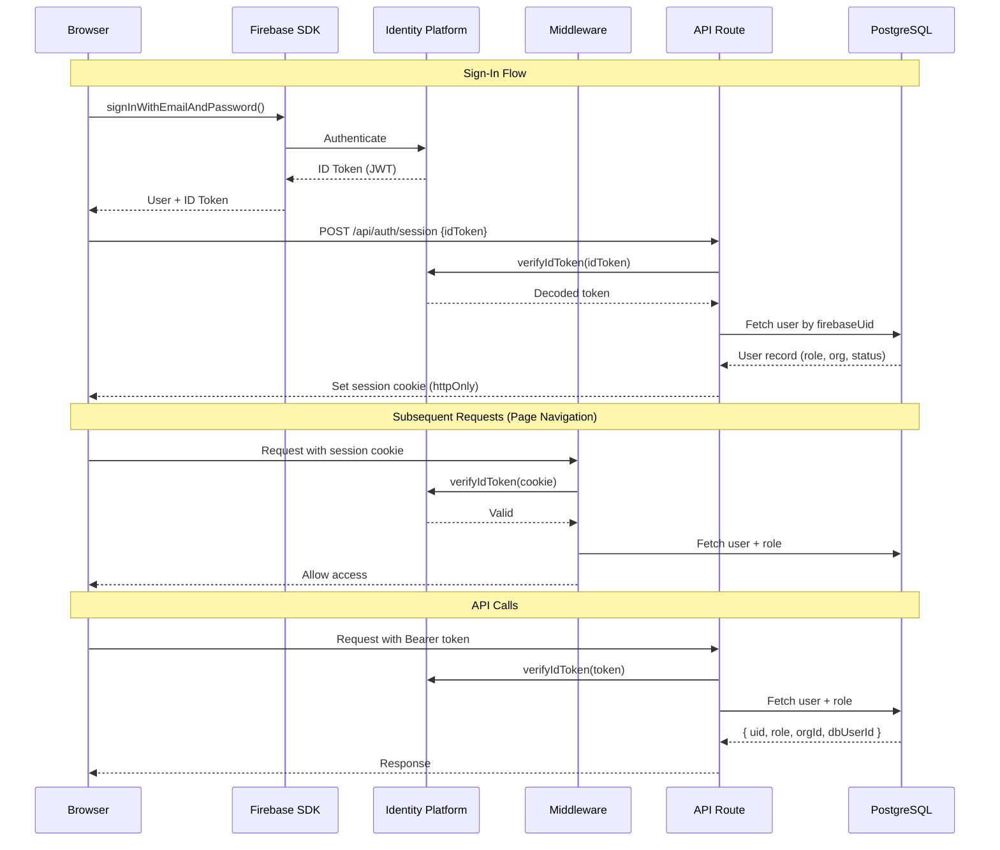

# Security Overview

> StoryCare's security architecture -- multi-layered defense for HIPAA-compliant healthcare data with Firebase authentication, RBAC, encryption, and audit logging.

---

## Security Layers

```
+------------------------------------------------------------------+
|                        Vercel Edge Network                        |
|                    (DDoS Protection, CDN, TLS)                    |
+------------------------------------------------------------------+
|                     Middleware Security Headers                    |
|              (CSP, HSTS, X-Frame-Options, etc.)                   |
+------------------------------------------------------------------+
|                    Firebase Authentication                        |
|            (ID Token Verification, Session Cookies)               |
+------------------------------------------------------------------+
|                    Role-Based Access Control                       |
|     (requireAuth, requireRole, requireTherapist, requireAdmin)    |
+------------------------------------------------------------------+
|                   Organization Boundaries                         |
|          (canAccessPatient, verifyTherapistPatientAccess)         |
+------------------------------------------------------------------+
|                    Data Encryption                                 |
|               (TLS in transit, AES-256 at rest)                   |
+------------------------------------------------------------------+
|                     HIPAA Audit Logging                           |
|         (audit_logs table, 7-year retention target)               |
+------------------------------------------------------------------+
```

---

## HIPAA Compliance Status

| Requirement | Status | Implementation |
|---|---|---|
| Access Controls | Implemented | Firebase Auth + custom RBAC |
| Audit Logging | Implemented | `audit_logs` table via `AuditService.ts` |
| Data Encryption (transit) | Implemented | TLS 1.2+ enforced via HSTS |
| Data Encryption (at rest) | Implemented | Neon PostgreSQL AES-256, GCS encryption |
| Session Management | Implemented | 24-hour token expiration |
| Minimum Necessary | Implemented | Organization boundary enforcement |
| MFA | Available | Firebase MFA (configuration required) |
| BAA with Providers | Partial | See Infrastructure Overview for status |
| Incident Response | Planned | Documented procedure needed |
| Data Retention | Planned | 7-year audit log retention target |
| Patient Data Export | Planned | HIPAA right-of-access compliance |
| Data Deletion | Planned | 90-day soft delete workflow |

---

## Security Headers

The middleware (`src/middleware.ts`) applies these headers to **all responses**, including API routes:

| Header | Value | Purpose |
|---|---|---|
| `X-Frame-Options` | `DENY` | Prevent clickjacking by blocking iframe embedding |
| `X-Content-Type-Options` | `nosniff` | Prevent MIME type sniffing attacks |
| `Strict-Transport-Security` | `max-age=31536000; includeSubDomains; preload` | Force HTTPS for 1 year, including subdomains |
| `Content-Security-Policy` | (see below) | Prevent XSS and injection attacks |
| `Permissions-Policy` | `camera=(), microphone=(self), geolocation=(), interest-cohort=()` | Restrict browser APIs (microphone allowed for recordings) |
| `Referrer-Policy` | `strict-origin-when-cross-origin` | Control referrer information leakage |
| `X-Powered-By` | (removed) | Hide server technology information |

### Content Security Policy Details

```
default-src 'self';
script-src  'self' 'unsafe-inline' 'unsafe-eval'
            https://cdn.jsdelivr.net
            https://*.firebaseapp.com
            https://*.googleapis.com
            https://widget.intercom.io
            https://js.intercomcdn.com;
style-src   'self' 'unsafe-inline';
img-src     'self' data: https: blob:;
font-src    'self' data: https://js.intercomcdn.com;
connect-src 'self'
            https://*.firebaseapp.com
            https://*.googleapis.com
            https://*.deepgram.com
            https://api.openai.com
            https://storage.googleapis.com
            https://*.intercom.io
            https://*.intercomcdn.com
            https://*.intercomassets.com;
media-src   'self' https://storage.googleapis.com blob:
            https://js.intercomcdn.com;
frame-src   'self' https://intercom-sheets.com
            https://*.intercom.io;
object-src  'none';
base-uri    'self';
form-action 'self';
frame-ancestors 'none';
upgrade-insecure-requests;
```

---

## Authentication Architecture

### Token Flow



### Key Security Controls

- **Token verification**: Every request verified via Firebase Admin SDK
- **Database role lookup**: Roles stored in DB, not Firebase claims (prevents token manipulation)
- **Auto-activation**: Invited users automatically activated on first login
- **Session cookies**: `httpOnly`, `secure`, `sameSite=strict`
- **Token expiration**: 24-hour maximum lifetime
- **Revocation**: Deleting session cookie forces re-authentication

---

## Arcjet Status

> **Important:** Arcjet is referenced in `CLAUDE.md` as the WAF and rate limiting solution, but it has been **removed** from the project. See `docs/ARCJET_REMOVED.md` for details. The application currently relies on:
> - Vercel's built-in DDoS protection
> - Edge network rate limiting
> - Application-level input validation (Zod)

---

## Input Validation

All API endpoints validate input with Zod schemas before processing:

```typescript
import { z } from 'zod';

const schema = z.object({
  title: z.string().min(1).max(255),
  sessionDate: z.string().datetime(),
  patientId: z.string().uuid(),
});

const validated = schema.parse(await request.json());
```

Validation schemas are centralized in `src/validations/`:
- `AuthValidation.ts`, `UserValidation.ts`, `SessionValidation.ts`
- `MediaValidation.ts`, `PageValidation.ts`, `TemplateValidation.ts`
- `OrganizationValidation.ts`, `ModuleValidation.ts`

---

## Audit Logging

### Tracked Actions

| Action | Description |
|---|---|
| `create` | New resource created |
| `read` | Resource accessed |
| `update` | Resource modified |
| `delete` | Resource deleted |
| `auth_success` | Successful authentication |
| `auth_failed` | Failed authentication attempt |
| `logout` | User logged out |
| `export` | Data exported |

### Tracked Resource Types

| Resource Type | Contains PHI? |
|---|---|
| `user` | Yes |
| `patient` | Yes |
| `session` | Yes |
| `transcript` | Yes |
| `media` | Yes |
| `story_page` | Yes |
| `reflection_question` | No |
| `survey_question` | No |
| `reflection_response` | Yes |
| `survey_response` | Yes |
| `template` | No |

### Audit Log Entry Structure

```json
{
  "userId": "uuid",
  "organizationId": "uuid",
  "action": "read",
  "resourceType": "patient",
  "resourceId": "uuid",
  "ipAddress": "192.168.1.1",
  "userAgent": "Mozilla/5.0...",
  "requestMethod": "GET",
  "requestPath": "/api/patients/abc-123",
  "metadata": {
    "isPHI": true,
    "accessReason": "clinical_workflow",
    "patientId": "uuid"
  },
  "createdAt": "2026-02-19T00:00:00Z"
}
```

---

## Key Security Files

| File | Purpose |
|---|---|
| `src/middleware.ts` | Route protection, security headers, session verification |
| `src/libs/FirebaseAdmin.ts` | Token verification + DB role lookup |
| `src/utils/AuthHelpers.ts` | `requireAuth()`, `requireRole()`, `canAccessPatient()`, `verifyTherapistPatientAccess()` |
| `src/services/AuditService.ts` | Audit log creation (HIPAA trail) |
| `src/libs/AuditLogger.ts` | Convenience wrappers (`logPHIAccess`, `logPHICreate`, etc.) |
| `src/utils/Encryption.ts` | Data encryption/decryption utilities |
| `src/validations/` | Zod validation schemas for all endpoints |
| `src/models/Schema.ts` | `audit_logs` table definition |
| `docs/ARCJET_REMOVED.md` | Documentation of Arcjet removal |
