# Services Overview

> StoryCare's service layer -- 20 service files encapsulating business logic, database operations, and external integrations. Services are used by API routes and never called directly from components.

---

## Service Inventory

| Service | File | Exported Functions | Primary Dependencies |
|---|---|---|---|
| **AiModelService** | `AiModelService.ts` | 14 | DB, Schema (`aiModelsSchema`) |
| **AssessmentService** | `AssessmentService.ts` | 14 | DB, Schema (`assessmentInstruments`, `assessmentSessions`, `assessmentResponses`) |
| **AuditService** | `AuditService.ts` | 4 | DB, Schema (`auditLogs`) |
| **BlockActionHandlers** | `BlockActionHandlers.ts` | 3 | MediaService, SceneService, TextGeneration |
| **ChatSummaryService** | `ChatSummaryService.ts` | 4 | DB, Schema (`aiChatMessages`), TextGeneration |
| **EmailService** | `EmailService.ts` | 13 | DB, Schema (`emailNotifications`, `platformSettings`), Paubox |
| **JSONActionHandlers** | `JSONActionHandlers.ts` | 15 | DB, Schema (media, quotes, scenes, notes), GCS, ImageGeneration, VideoGeneration |
| **ModuleService** | `ModuleService.ts` | 18 | DB, Schema (`treatmentModules`, `moduleAiPrompts`, `modulePromptLinks`) |
| **MusicTaskService** | `MusicTaskService.ts` | -- | (Webhook handler support) |
| **OrgAdminService** | `OrgAdminService.ts` | 1 | DB, Schema (users, sessions, organizations) |
| **OrganizationService** | `OrganizationService.ts` | 6 | DB, Schema (`organizations`, `users`, `sessions`), EmailService |
| **PatientReferenceImageService** | `PatientReferenceImageService.ts` | 7 | DB, Schema, GCS |
| **SessionService** | `SessionService.ts` | 9 | DB, Schema (`sessions`, `sessionModules`, `treatmentModules`), ModuleService |
| **SessionSummaryService** | `SessionSummaryService.ts` | 3 | DB, Schema (sessions, transcripts, speakers, utterances), TextGeneration |
| **StoryPageGeneratorService** | `StoryPageGeneratorService.ts` | 2 | DB, Schema (`storyPages`, `pageBlocks`, `mediaLibrary`), EmailService, ModuleService, SessionService |
| **TemplateService** | `TemplateService.ts` | 12 | DB, Schema (survey/reflection templates) |
| **VideoService** | `VideoService.ts` | Class (6+ methods) | GCS, FFmpeg (child_process) |
| **VideoTaskService** | `VideoTaskService.ts` | -- | (Video task polling support) |
| **VideoTranscodingService** | `VideoTranscodingService.ts` | Class (5+ methods) | Google Cloud Run (JobsClient, ExecutionsClient), GCS |
| **WorkflowExecutorService** | `WorkflowExecutorService.ts` | 3 + Class | DB, Schema (media, quotes), BlockDefinitions, TemplateInterpolation |

---

## Service Details

### AiModelService

Manages the `ai_models` database table -- CRUD operations for AI model registry with pricing, status, and capabilities.

| Function | Description |
|---|---|
| `listAiModels(params?)` | List models with filtering (category, provider, status, search) |
| `getModelsForCategory(category)` | Get active models for a specific category |
| `getAiModelById(id)` | Get model by database UUID |
| `getAiModelByModelId(modelId)` | Get model by model ID string |
| `isValidModel(modelId)` | Check if model exists and is active |
| `getModelCost(modelId)` | Get cost per unit from DB (for Langfuse) |
| `getApiModelId(modelId)` | Get the API provider's model ID |
| `createAiModel(data)` | Create new model entry |
| `updateAiModel(id, data)` | Update model (enforces single-active transcription constraint) |
| `bulkUpdateModelStatus(ids, status)` | Bulk status change (enforces single-active transcription) |
| `deleteAiModel(id)` | Delete model |
| `getModelCountsByCategory()` | Aggregate counts per category |
| `getUniqueProviders()` | List distinct provider names |
| `upsertAiModel(data)` | Insert or update by modelId |

### AssessmentService

Manages clinical assessment instruments, sessions, and responses for standardized psychological measures.

| Function | Description |
|---|---|
| `listInstruments(params?)` | List assessment instruments with filtering |
| `getInstrument(id)` | Get instrument with items |
| `createInstrument(data)` | Create new instrument with items and scoring rules |
| `updateInstrument(id, data)` | Update instrument details |
| `updateInstrumentStatus(id, status)` | Change instrument status |
| `deleteInstrument(id)` | Delete instrument |
| `createAssessmentSession(data)` | Start new assessment for a patient |
| `getAssessmentSession(id)` | Get session with instrument, items, and responses |
| `listPatientAssessments(patientId, params)` | List assessments for a patient |
| `updateAssessmentSession(id, data)` | Update session metadata |
| `listAssessments(params)` | List assessments with role-based scoping |
| `deleteAssessmentSession(id)` | Delete in-progress assessment |
| `saveResponses(sessionId, responses)` | Batch upsert item responses |
| `completeAssessment(sessionId, notes?)` | Calculate scores and mark complete |

### AuditService

HIPAA-compliant audit logging for all PHI access and modifications.

| Function | Description |
|---|---|
| `createAuditLog(entry)` | Write audit entry (never throws) |
| `logAuditFromRequest(request, user, action, resourceType, resourceId?, metadata?)` | Log from HTTP request context |
| `logPHIAccess(request, user, action, phiType, resourceId, patientId?)` | Log PHI access with patient linkage |
| `logBulkPHIAccess(request, user, phiType, count, patientIds?)` | Log bulk PHI access (list operations) |

### ChatSummaryService

Manages conversation summaries for AI context caching -- compresses long chat histories into summaries to stay within token limits.

| Function | Description |
|---|---|
| `shouldGenerateChatSummary(sessionId, threshold?)` | Check if summary needed (default: 10 messages) |
| `generateChatSummary(sessionId, options?)` | Generate summary via Gemini |
| `getLatestChatSummary(sessionId)` | Get most recent summary |
| `getAllChatSummaries(sessionId)` | Get all summaries for a session |

### EmailService

HIPAA-compliant email via Paubox for all transactional notifications.

| Function | Description |
|---|---|
| `sendStoryPageNotification(params)` | Notify patient of published story page |
| `sendModuleCompletionNotification(params)` | Notify of module completion |
| `sendTherapistInvitationEmail(params)` | Invite therapist to platform |
| `sendPatientInvitationEmail(params)` | Invite patient to platform |
| `sendOrgAdminInvitationEmail(params)` | Invite org admin to platform |
| `sendSessionReminderEmail(params)` | Remind about upcoming session |
| `sendSurveyReminderEmail(params)` | Remind patient to complete survey |
| `sendPasswordResetEmail(params)` | Send password reset link |
| `updateEmailStatus(notificationId, status)` | Update delivery status |
| `getEmailSettings()` | Get platform email settings |
| `validateEmailConfig()` | Verify Paubox is configured |
| `getEmailNotificationById(id)` | Get notification details |
| `listEmailNotifications(params)` | List notifications with filtering |

### JSONActionHandlers

Handles AI-generated JSON action blocks -- when the AI suggests creating media, scenes, or saving content, these handlers execute the actions.

| Function | Description |
|---|---|
| `handleCreateScene(ctx)` | Create scene from AI suggestion |
| `handleGenerateImages(ctx)` | Generate multiple images |
| `handleGenerateMusic(ctx)` | Generate music track |
| `handleGenerateSingleImage(ctx)` | Generate one image |
| `handleGenerateSingleVideo(ctx)` | Generate one video |
| `handleGenerateInstrumental(ctx)` | Generate instrumental music |
| `handleGenerateLyrical(ctx)` | Generate lyrical music |
| `handleSaveReflections(ctx)` | Save reflection questions |
| `handleCreateScenesFromSuggestions(ctx)` | Batch create scenes |
| `handleSaveScenesAsNotes(ctx)` | Save scene suggestions as notes |
| `handleSaveToTemplateLibrary(ctx)` | Save to template library |
| `handleAddReflectionsToModule(ctx)` | Add reflections to module |
| `handleSaveAsNote(ctx)` | Save content as a note |
| `handleSaveTherapeuticNote(ctx)` | Save therapeutic note |
| `handleSaveQuotes(ctx)` | Save extracted quotes |

### ModuleService

Treatment module management across three scope levels: system, organization, and therapist.

| Function | Description |
|---|---|
| `createModule(data)` | Create treatment module |
| `listModules(params)` | List modules with scope/domain filtering |
| `getModuleById(moduleId)` | Get module with prompt links |
| `updateModule(moduleId, data)` | Update module details |
| `archiveModule(moduleId)` | Archive module |
| `incrementModuleUseCount(moduleId)` | Track usage |
| `getModulesByDomain(domain, params)` | Filter by therapeutic domain |
| `getModuleStats(moduleId)` | Usage statistics |
| `submitModuleForApproval(moduleId)` | Submit for admin review |
| `approveModule(moduleId)` | Approve pending module |
| `getPendingModules(organizationId)` | List awaiting approval |
| `listTemplates(params?)` | List system templates |
| `createTemplate(data)` | Create system template |
| `listOrgModules(orgId, params)` | List organization modules |
| `createOrgModule(data)` | Create org-level module |
| `copyTemplateToOrg(templateId, orgId, userId)` | Copy system template to org |
| `listTherapistModules(therapistId, params)` | List therapist's modules |
| `createTherapistModule(data)` | Create therapist module |
| `updateModulePromptLinks(moduleId, promptIds)` | Update linked prompts |

### OrganizationService

Organization lifecycle management including creation with admin user provisioning.

| Function | Description |
|---|---|
| `createOrganization(data)` | Create org + invite org admin |
| `getOrganizationWithMetrics(orgId)` | Org details with user/session counts |
| `listOrganizations(params?)` | List all organizations |
| `updateOrganization(orgId, data)` | Update org settings |
| `deleteOrganization(orgId)` | Delete organization |
| `getPlatformMetrics()` | Platform-wide aggregate metrics |

### PatientReferenceImageService

Manages patient reference images for AI-powered image generation (face consistency).

| Function | Description |
|---|---|
| `getPatientReferenceImages(patientId)` | List all reference images |
| `getPrimaryReferenceImage(patientId)` | Get primary reference image |
| `addReferenceImage(params)` | Upload and store reference image |
| `setPrimaryReferenceImage(patientId, imageId)` | Set primary image |
| `updateReferenceImageLabel(imageId, label)` | Update image label |
| `deleteReferenceImage(imageId)` | Delete reference image from GCS + DB |
| `hasReferenceImages(patientId)` | Check if patient has any references |

### SessionService

Session and module assignment management -- links therapy sessions to treatment modules and tracks analysis.

| Function | Description |
|---|---|
| `assignModuleToSession(params)` | Assign/reassign module to session |
| `getSessionWithModule(sessionId)` | Get session with module details |
| `updateSessionModuleAnalysis(sessionId, result)` | Store AI analysis result |
| `linkStoryPageToSessionModule(sessionId, storyPageId)` | Link generated page to session |
| `getSessionsByModule(moduleId, limit?)` | List sessions using a module |
| `getSessionModuleBySessionId(sessionId)` | Get module assignment |
| `removeModuleFromSession(sessionId)` | Remove module assignment |
| `getSessionsWithModules(params)` | List sessions with modules |
| `hasCompletedModuleAnalysis(sessionId)` | Check analysis status |

### SessionSummaryService

AI-powered session summary generation for context caching.

| Function | Description |
|---|---|
| `generateSessionSummary(sessionId, options?)` | Generate summary from transcript via Gemini |
| `getOrCreateSessionSummary(sessionId, options?)` | Get cached or generate new summary |
| `regenerateSessionSummary(sessionId, options?)` | Force regenerate summary |

### StoryPageGeneratorService

Auto-generates story pages from module-analyzed sessions with media content.

| Function | Description |
|---|---|
| `generateStoryPageFromModule(params)` | Generate complete story page from module analysis |
| `publishAndNotify(params)` | Publish page and send email notification to patient |

### TemplateService

Reflection and survey template management with approval workflow.

| Function | Description |
|---|---|
| `createSurveyTemplate(data)` | Create survey template |
| `createReflectionTemplate(data)` | Create reflection template |
| `listSurveyTemplates(params)` | List survey templates |
| `listReflectionTemplates(params)` | List reflection templates |
| `submitSurveyTemplateForApproval(id, orgId)` | Submit survey for review |
| `submitReflectionTemplateForApproval(id, orgId)` | Submit reflection for review |
| `approveSurveyTemplate(id)` | Approve survey template |
| `approveReflectionTemplate(id)` | Approve reflection template |
| `rejectSurveyTemplate(id)` | Reject survey template |
| `rejectReflectionTemplate(id)` | Reject reflection template |
| `getPendingSurveyTemplates(orgId)` | List pending surveys |
| `getPendingReflectionTemplates(orgId)` | List pending reflections |

### VideoService (Class)

FFmpeg-based video assembly -- stitches clips, overlays audio tracks, and uploads to GCS.

| Method | Description |
|---|---|
| `assembleVideo(options)` | Assemble video from clips and audio |
| `downloadFile(url, path)` | Download file from URL |
| `uploadToGCS(localPath, gcsPath)` | Upload assembled video |
| `cleanupTempFiles(paths)` | Clean up temporary files |
| `getVideoDuration(path)` | Get video duration via FFprobe |
| `generateThumbnail(videoPath)` | Generate thumbnail image |

### VideoTranscodingService (Class)

GPU-accelerated video transcoding via Google Cloud Run Jobs.

| Method | Description |
|---|---|
| `startTranscodingJob(options)` | Create Cloud Run transcoding job |
| `getJobStatus(jobName, executionName)` | Check job status |
| `getTranscodedVideoUrl(filename)` | Get presigned URL for output |
| `cancelJob(jobName, executionName)` | Cancel running job |
| `listJobs(filter?)` | List transcoding jobs |

### WorkflowExecutorService (Class + Functions)

Manages hybrid execution of building block workflows (auto + manual action steps).

| Function/Method | Description |
|---|---|
| `createWorkflowExecution(blocks, context)` | Create new workflow execution |
| `startWorkflow(execution)` | Begin executing workflow blocks |
| `executeManualAction(execution, request)` | Execute user-triggered action |
| `WorkflowExecutor.execute()` | Run automatic blocks until manual action needed |
| `WorkflowExecutor.handleAction(request)` | Process manual action and resume |

---

## Service Interaction Diagram

```mermaid
graph TB
    subgraph API_Routes["API Routes"]
        SessionAPI["Sessions API"]
        PatientAPI["Patients API"]
        MediaAPI["Media API"]
        PageAPI["Pages API"]
        ModuleAPI["Modules API"]
        AdminAPI["Admin APIs"]
        AIAPI["AI APIs"]
        AuthAPI["Auth APIs"]
    end

    subgraph Services["Service Layer"]
        SessionSvc["SessionService"]
        SessionSumSvc["SessionSummaryService"]
        ChatSumSvc["ChatSummaryService"]
        ModuleSvc["ModuleService"]
        TemplateSvc["TemplateService"]
        StoryGenSvc["StoryPageGeneratorService"]
        EmailSvc["EmailService"]
        AuditSvc["AuditService"]
        OrgSvc["OrganizationService"]
        OrgAdminSvc["OrgAdminService"]
        AiModelSvc["AiModelService"]
        AssessSvc["AssessmentService"]
        PatRefImgSvc["PatientReferenceImageService"]
        VideoSvc["VideoService"]
        VideoTransSvc["VideoTranscodingService"]
        WorkflowSvc["WorkflowExecutorService"]
        JSONHandlers["JSONActionHandlers"]
        BlockHandlers["BlockActionHandlers"]
    end

    subgraph External["External Services"]
        DB[(Neon PostgreSQL)]
        GCS[Google Cloud Storage]
        Gemini[Google Gemini]
        AtlasCloud[Atlas Cloud]
        Suno[Suno AI]
        Deepgram[Deepgram]
        Paubox[Paubox Email]
        CloudRun[Cloud Run Jobs]
        Langfuse[Langfuse]
    end

    %% API -> Service connections
    SessionAPI --> SessionSvc
    SessionAPI --> SessionSumSvc
    SessionAPI --> ChatSumSvc
    PatientAPI --> PatRefImgSvc
    ModuleAPI --> ModuleSvc
    PageAPI --> StoryGenSvc
    AdminAPI --> OrgSvc
    AdminAPI --> OrgAdminSvc
    AdminAPI --> AiModelSvc
    AdminAPI --> AssessSvc
    AIAPI --> JSONHandlers
    AIAPI --> BlockHandlers

    %% Service -> Service connections
    StoryGenSvc --> EmailSvc
    StoryGenSvc --> ModuleSvc
    StoryGenSvc --> SessionSvc
    OrgSvc --> EmailSvc
    SessionSvc --> ModuleSvc
    WorkflowSvc --> JSONHandlers
    BlockHandlers --> JSONHandlers

    %% Service -> External connections
    SessionSvc --> DB
    ModuleSvc --> DB
    TemplateSvc --> DB
    AuditSvc --> DB
    EmailSvc --> DB
    EmailSvc --> Paubox
    OrgSvc --> DB
    AiModelSvc --> DB
    AssessSvc --> DB
    PatRefImgSvc --> DB
    PatRefImgSvc --> GCS
    VideoSvc --> GCS
    VideoTransSvc --> CloudRun
    VideoTransSvc --> GCS
    SessionSumSvc --> Gemini
    ChatSumSvc --> Gemini
    JSONHandlers --> AtlasCloud
    JSONHandlers --> GCS
    JSONHandlers --> DB
```

---

## Design Principles

1. **Separation of concerns**: API routes handle HTTP parsing, validation, and auth. Services handle business logic and database operations.
2. **No circular dependencies**: Services import from `@/libs/` and `@/models/`, not from other services unless explicitly needed (e.g., `StoryPageGeneratorService` imports `EmailService`).
3. **Never throw in audit**: `AuditService.createAuditLog()` catches all errors internally to prevent audit failures from breaking requests.
4. **Single-active constraints**: `AiModelService` enforces that only one transcription model can be active at a time.
5. **Scope hierarchy**: Modules, templates, and prompts follow a system > organization > therapist hierarchy with approval workflows.

---

## Key Source Directory

All service files are located at: `src/services/`
